# WebServer-Reactor

基于 C++17 实现的**主从 Reactor 模式**高并发 Web 服务器，采用完全工程化结构设计，支持 HTTP/1.1 协议、MySQL/Redis 主从复制、自动故障转移、实时性能监控。

## 核心特性 / Core Features

| 特性 | 说明 |
|------|------|
| 🎯 **标准主从 Reactor 架构** | 主 Reactor 仅负责连接接受，从 Reactor 负责 IO 事件处理，职责清晰，扩展性强 |
| 🧵 **One Loop Per Thread** | 每个 IO 线程绑定独立 EventLoop，线程间无锁竞争，**实测静态资源 QPS 突破 14 万** |
| ⚡ **高性能 IO 模型** | Epoll 边缘触发 (ET) + 非阻塞 Socket + TCP_NODELAY，显著降低延迟 |
| 🚀 **智能传输优化** | 小文件（≤24KB）使用内存缓存，大文件使用 sendfile 零拷贝 |
| 🔄 **MySQL 主从复制** | 读写分离 + 轮询负载均衡 + 半同步复制 + 复制延迟监控 + 自动故障转移 |
| 💾 **Redis 主从复制** | 读写分离 + WAIT 命令强一致性 + 复制偏移量监控 + 自动故障转移 |
| 🛡️ **自动容灾** | 主库故障自动检测与转移、从库健康检查、数据备份、告警回调 |
| 🔒 **安全设计** | SHA256 密码哈希、参数化 SQL 查询（防注入）、连接池隔离 |
| 📊 **实时性能监控** | 内置 Prometheus 格式指标导出，包含请求耗时、缓存命中率、主从状态等 |
| 🏗️ **工程化结构** | 模块化分层 (net/http/server/auth/monitor)、CMake 构建、统一命名空间 |

## 快速开始 / Quick Start

### 环境要求 / Requirements

- **操作系统 / OS**：Linux 内核 2.6+（依赖 Epoll 系统调用 / Requires Epoll syscall）
- **编译器 / Compiler**：GCC 7+ / Clang 5+（支持 C++17 / C++17 support）
- **构建工具 / Build Tool**：CMake 3.10+
- **数据库 / Database**：MySQL 5.7+（用户认证 + 主从复制 / Auth + Replication）
- **缓存服务 / Cache Service**：Redis 5.0+（缓存 + 主从复制 / Cache + Replication）
- **依赖库 / Dependencies**：libmysqlclient-dev, libhiredis-dev, libssl-dev

### 1. 安装依赖 / Install Dependencies

```bash
# Ubuntu/Debian
apt update && apt install -y cmake g++ libmysqlclient-dev libhiredis-dev libssl-dev

# CentOS/RHEL
yum install -y cmake gcc-c++ mysql-devel hiredis-devel openssl-devel
```

### 2. 配置 MySQL / Configure MySQL

```bash
mysql -u root -p
CREATE DATABASE webserver_db;
# 用户表会在服务器启动时自动创建 / Users table auto-created on startup
```

### 3. 配置 Redis / Configure Redis

```bash
systemctl start redis
redis-cli ping  # 返回 PONG 表示正常 / PONG means OK
```

### 4. 编译项目 / Build Project

```bash
git clone <github.com/Linsdfe/WebServer-Reactor>
cd WebServer-Reactor
mkdir build && cd build
cmake .. -DCMAKE_BUILD_TYPE=Release
make -j$(nproc)
```

### 5. 运行服务器 / Run Server

```bash
cd bin

# 单机模式 / Standalone Mode
./server 8888 8 localhost root 123456 webserver_db

# MySQL 主从模式 / MySQL Master-Slave Mode
./server 8888 8 localhost root 123456 webserver_db 127.0.0.1:3307,127.0.0.1:3308

# MySQL + Redis 主从模式 / MySQL + Redis Master-Slave Mode
./server 8888 8 localhost root 123456 webserver_db 127.0.0.1:3307 127.0.0.1:6380,127.0.0.1:6381
```

**命令行参数 / CLI Arguments**：

| 参数 / Parameter | 位置 | 默认值 | 说明 |
|------|------|--------|------|
| 端口 / Port | 1 | 8888 | 监听端口 / Listening port |
| IO线程数 / IO Threads | 2 | CPU核心数×2 | 从 Reactor 线程数 / Sub Reactor thread count |
| MySQL主机 / MySQL Host | 3 | localhost | MySQL 主库地址 / MySQL master address |
| MySQL用户 / MySQL User | 4 | root | MySQL 用户名 / MySQL username |
| MySQL密码 / MySQL Password | 5 | 123456 | MySQL 密码 / MySQL password |
| MySQL数据库 / MySQL DB | 6 | webserver_db | 数据库名 / Database name |
| MySQL从库 / MySQL Slaves | 7 | 空 | 格式：host1:port1,host2:port2 |
| Redis从库 / Redis Slaves | 8 | 空 | 格式：host1:port1,host2:port2 |

### 6. 访问测试 / Access Test

- **登录页面 / Login Page**：`http://localhost:8888/`
- **监控面板 / Dashboard**：`http://localhost:8888/dashboard.html`
- **性能指标 / Metrics**：`http://localhost:8888/metrics`

## 项目架构 / Project Architecture

```
WebServer-Reactor/
├── include/                    # 头文件目录 / Header Directory
│   ├── net/                    # 网络层 / Network Layer (Reactor 核心)
│   │   ├── eventloop.h         #   事件循环 / Event Loop (One Loop Per Thread)
│   │   ├── epoller.h           #   epoll 封装 / Epoll Wrapper
│   │   ├── channel.h           #   fd 与事件绑定 / fd-Event Binding
│   │   ├── acceptor.h          #   连接接受器 / Connection Acceptor (主 Reactor)
│   │   ├── eventloopthread.h   #   IO 线程封装 / IO Thread Wrapper
│   │   └── eventloopthreadpool.h # IO 线程池 / IO Thread Pool
│   ├── http/                   # HTTP 协议层 / HTTP Protocol Layer
│   │   ├── httprequest.h       #   HTTP 请求解析 / Request Parser (FSM + 粘包处理)
│   │   └── httpresponse.h      #   HTTP 响应构建 / Response Builder (MIME + 零拷贝)
│   ├── server/                 # 服务器层 / Server Layer
│   │   ├── server.h            #   服务器核心 / Server Core (连接管理 + 模块协调)
│   │   ├── tcpconnection.h     #   TCP 连接管理 / TCP Connection (IO + HTTP + 路由)
│   │   ├── cachemanager.h      #   静态资源缓存 / Static Cache (LRU + shared_mutex)
│   │   └── redis_cache.h       #   Redis 缓存外观 / Redis Cache Facade
│   ├── auth/                   # 认证与数据层 / Auth & Data Layer
│   │   ├── auth.h              #   用户认证 / User Auth (SHA256 + 会话管理)
│   │   ├── mysql_connection_pool.h # MySQL 连接池 / MySQL Pool (主从 + 故障转移)
│   │   └── redis_connection_pool.h # Redis 连接池 / Redis Pool (主从 + 故障转移)
│   └── monitor/                # 监控层 / Monitor Layer
│       └── metrics_collector.h #   指标收集器 / Metrics Collector (Prometheus)
├── src/                        # 源文件目录 / Source Directory (与 include 一一对应)
├── www/                        # 静态资源目录 / Static Resources
│   ├── index.html              #   登录页 / Login Page
│   ├── welcome.html            #   欢迎页 / Welcome Page
│   └── dashboard.html          #   监控面板 / Monitoring Dashboard
├── CMakeLists.txt              # CMake 构建配置 / Build Configuration
└── README.md                   # 项目文档 / Project Documentation
```

### 模块分层架构 / Module Layering

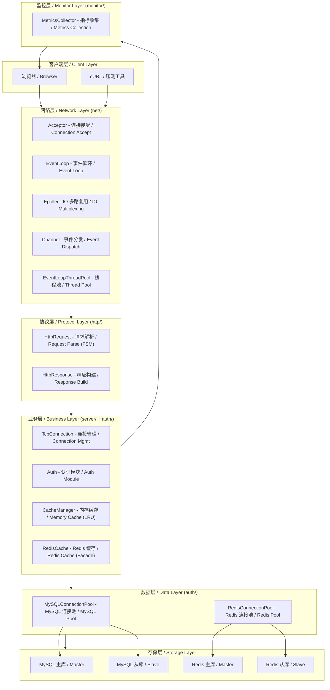
```mermaid
flowchart TB
    subgraph ClientLayer["客户端层 / Client Layer"]
        Browser["浏览器 / Browser"]
        Curl["cURL / 压测工具"]
    end

    subgraph NetworkLayer["网络层 / Network Layer (net/)"]
        Acceptor["Acceptor - 连接接受 / Connection Accept"]
        EventLoop["EventLoop - 事件循环 / Event Loop"]
        Epoller["Epoller - IO 多路复用 / IO Multiplexing"]
        Channel["Channel - 事件分发 / Event Dispatch"]
        ThreadPool["EventLoopThreadPool - 线程池 / Thread Pool"]
    end

    subgraph ProtocolLayer["协议层 / Protocol Layer (http/)"]
        ReqParser["HttpRequest - 请求解析 / Request Parse (FSM)"]
        ResBuilder["HttpResponse - 响应构建 / Response Build"]
    end

    subgraph BusinessLayer["业务层 / Business Layer (server/ + auth/)"]
        TcpConn["TcpConnection - 连接管理 / Connection Mgmt"]
        AuthModule["Auth - 认证模块 / Auth Module"]
        CacheMgr["CacheManager - 内存缓存 / Memory Cache (LRU)"]
        RedisCache["RedisCache - Redis 缓存 / Redis Cache (Facade)"]
    end

    subgraph DataLayer["数据层 / Data Layer (auth/)"]
        MySQLPool["MySQLConnectionPool - MySQL 连接池 / MySQL Pool"]
        RedisPool["RedisConnectionPool - Redis 连接池 / Redis Pool"]
    end

    subgraph MonitorLayer["监控层 / Monitor Layer (monitor/)"]
        Metrics["MetricsCollector - 指标收集 / Metrics Collection"]
    end

    subgraph StorageLayer["存储层 / Storage Layer"]
        MySQLMaster["MySQL 主库 / Master"]
        MySQLSlave["MySQL 从库 / Slave"]
        RedisMaster["Redis 主库 / Master"]
        RedisSlave["Redis 从库 / Slave"]
    end

    Browser --> NetworkLayer
    Curl --> NetworkLayer
    NetworkLayer --> ProtocolLayer
    ProtocolLayer --> BusinessLayer
    BusinessLayer --> DataLayer
    DataLayer --> StorageLayer
    BusinessLayer --> MonitorLayer
    MonitorLayer --> Browser

    MySQLPool --> MySQLMaster
    MySQLPool --> MySQLSlave
    RedisPool --> RedisMaster
    RedisPool --> RedisSlave
```

## 核心原理解析 / Core Principles

### 架构与线程 / Architecture & Threading

#### 主从 Reactor 模式 / Master-Slave Reactor Pattern

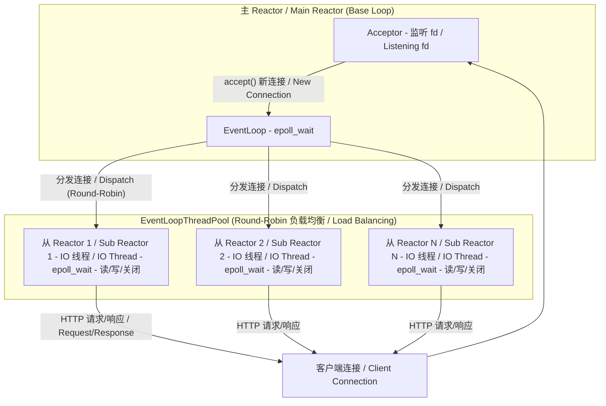
```mermaid
flowchart TB
    subgraph MainReactor["主 Reactor / Main Reactor (Base Loop)"]
        Acceptor["Acceptor - 监听 fd / Listening fd"]
        MainLoop["EventLoop - epoll_wait"]
    end

    subgraph ThreadPool["EventLoopThreadPool (Round-Robin 负载均衡 / Load Balancing)"]
        SubReactor1["从 Reactor 1 / Sub Reactor 1 - IO 线程 / IO Thread - epoll_wait - 读/写/关闭"]
        SubReactor2["从 Reactor 2 / Sub Reactor 2 - IO 线程 / IO Thread - epoll_wait - 读/写/关闭"]
        SubReactorN["从 Reactor N / Sub Reactor N - IO 线程 / IO Thread - epoll_wait - 读/写/关闭"]
    end

    Client["客户端连接 / Client Connection"] --> Acceptor
    Acceptor -->|"accept() 新连接 / New Connection"| MainLoop
    MainLoop -->|"分发连接 / Dispatch (Round-Robin)"| SubReactor1
    MainLoop -->|"分发连接 / Dispatch"| SubReactor2
    MainLoop -->|"分发连接 / Dispatch"| SubReactorN

    SubReactor1 -->|"HTTP 请求/响应 / Request/Response"| Client
    SubReactor2 -->|"HTTP 请求/响应"| Client
    SubReactorN -->|"HTTP 请求/响应"| Client
```

- **主 Reactor / Main Reactor**：仅负责监听端口，通过 `accept()` 接受新连接
- **从 Reactor / Sub Reactor**：负责已建立连接的 IO 事件处理（读/写/关闭）
- **线程池 / Thread Pool**：通过轮询 (Round-Robin) 分配新连接，实现负载均衡

#### Epoll 触发模式对比 / Epoll Trigger Mode Comparison

本项目采用 **边缘触发 (ET)** 模式，以下是两种模式的详细对比：

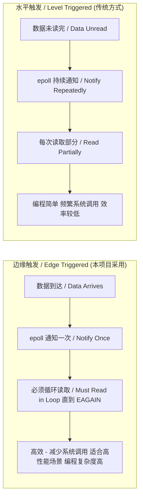
```mermaid
flowchart LR
    subgraph ET["边缘触发 / Edge Triggered (本项目采用)"]
        direction TB
        ET1["数据到达 / Data Arrives"] --> ET2["epoll 通知一次 / Notify Once"]
        ET2 --> ET3["必须循环读取 / Must Read in Loop 直到 EAGAIN"]
        ET3 --> ET4["高效 - 减少系统调用 适合高性能场景 编程复杂度高"]
    end

    subgraph LT["水平触发 / Level Triggered (传统方式)"]
        direction TB
        LT1["数据未读完 / Data Unread"] --> LT2["epoll 持续通知 / Notify Repeatedly"]
        LT2 --> LT3["每次读取部分 / Read Partially"]
        LT3 --> LT4["编程简单 频繁系统调用 效率较低"]
    end
```

| 对比项 / Comparison | 边缘触发 ET (Edge Triggered) | 水平触发 LT (Level Triggered) |
|------|------|------|
| 通知时机 / Notify When | 状态变化时通知一次 | 数据未处理完持续通知 |
| 读取方式 / Read Strategy | 必须循环读取直到 `EAGAIN` | 可部分读取 |
| 系统调用次数 / Syscall Count | 少（一次性读完） | 多（多次通知） |
| 编程复杂度 / Complexity | 高（需处理不完整读） | 低 |
| 适用场景 / Use Case | 高性能服务器 | 简单应用 |
| 本项目选择 / Our Choice | ✅ 采用 | ❌ |

#### 线程交互模型 / Thread Interaction Model

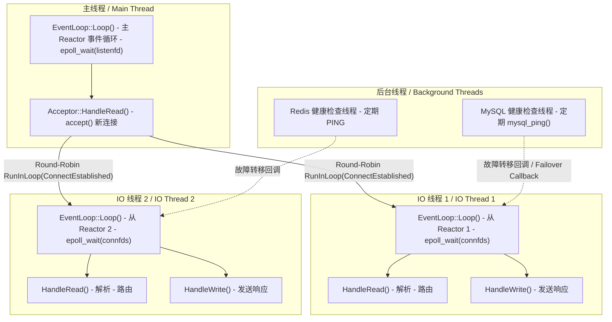
```mermaid
flowchart TB
    subgraph MainThread["主线程 / Main Thread"]
        MainLoop["EventLoop::Loop() - 主 Reactor 事件循环 - epoll_wait(listenfd)"]
        Accept["Acceptor::HandleRead() - accept() 新连接"]
        MainLoop --> Accept
    end

    subgraph IOThread1["IO 线程 1 / IO Thread 1"]
        Loop1["EventLoop::Loop() - 从 Reactor 1 - epoll_wait(connfds)"]
        Read1["HandleRead() - 解析 - 路由"]
        Write1["HandleWrite() - 发送响应"]
        Loop1 --> Read1
        Loop1 --> Write1
    end

    subgraph IOThread2["IO 线程 2 / IO Thread 2"]
        Loop2["EventLoop::Loop() - 从 Reactor 2 - epoll_wait(connfds)"]
        Read2["HandleRead() - 解析 - 路由"]
        Write2["HandleWrite() - 发送响应"]
        Loop2 --> Read2
        Loop2 --> Write2
    end

    subgraph BgThreads["后台线程 / Background Threads"]
        MySQLHC["MySQL 健康检查线程 - 定期 mysql_ping()"]
        RedisHC["Redis 健康检查线程 - 定期 PING"]
    end

    Accept -->|"Round-Robin RunInLoop(ConnectEstablished)"| Loop1
    Accept -->|"Round-Robin RunInLoop(ConnectEstablished)"| Loop2

    MySQLHC -.->|"故障转移回调 / Failover Callback"| Loop1
    RedisHC -.->|"故障转移回调"| Loop2
```

**关键设计 / Key Design**：
- **无锁竞争 / No Lock Contention**：每个从 Reactor 独占一个线程，连接只属于一个 EventLoop
- **跨线程通信 / Cross-Thread Communication**：通过 `RunInLoop()` / `QueueInLoop()` + `eventfd` 唤醒机制安全投递任务
- **健康检查独立 / Independent Health Check**：MySQL/Redis 健康检查在独立线程运行，不阻塞 IO 线程

#### 连接生命周期 / Connection Lifecycle

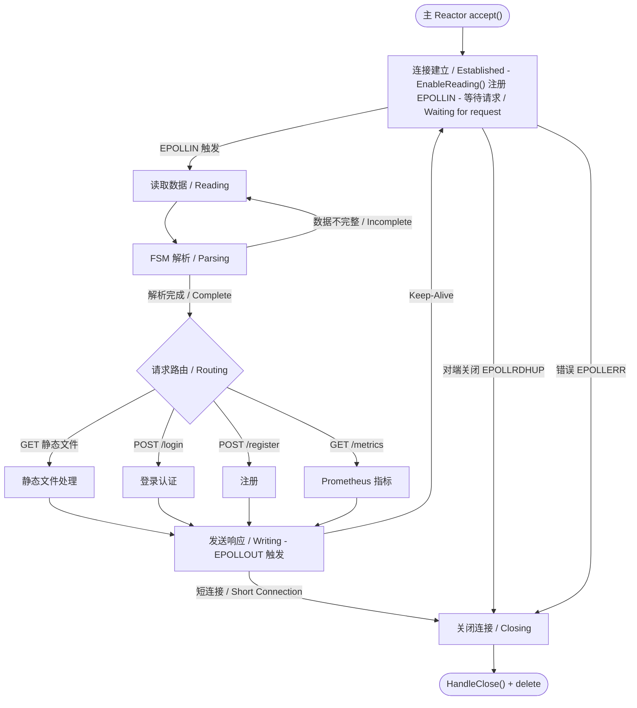
```mermaid
flowchart TD
    Accepting(["主 Reactor accept()"]) --> Established["连接建立 / Established - EnableReading() 注册 EPOLLIN - 等待请求 / Waiting for request"]

    Established -->|"EPOLLIN 触发"| Reading["读取数据 / Reading"]
    Reading --> Parsing["FSM 解析 / Parsing"]
    Parsing -->|"数据不完整 / Incomplete"| Reading
    Parsing -->|"解析完成 / Complete"| Routing{"请求路由 / Routing"}

    Routing -->|"GET 静态文件"| StaticFile["静态文件处理"]
    Routing -->|"POST /login"| Login["登录认证"]
    Routing -->|"POST /register"| Register["注册"]
    Routing -->|"GET /metrics"| Metrics["Prometheus 指标"]

    StaticFile --> Writing["发送响应 / Writing - EPOLLOUT 触发"]
    Login --> Writing
    Register --> Writing
    Metrics --> Writing

    Writing -->|"Keep-Alive"| Established
    Writing -->|"短连接 / Short Connection"| Closing["关闭连接 / Closing"]

    Established -->|"对端关闭 EPOLLRDHUP"| Closing
    Established -->|"错误 EPOLLERR"| Closing
    Closing --> Closed(["HandleClose() + delete"])
```

### 数据层与复制 / Data Layer & Replication

#### MySQL 主从复制架构 / MySQL Master-Slave Replication

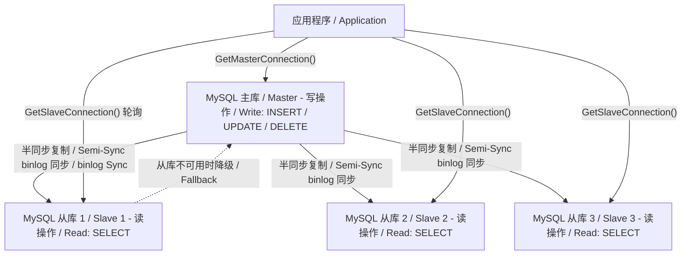
```mermaid
flowchart TB
    Master["MySQL 主库 / Master - 写操作 / Write: INSERT / UPDATE / DELETE"]

    Master -->|"半同步复制 / Semi-Sync binlog 同步 / binlog Sync"| Slave1["MySQL 从库 1 / Slave 1 - 读操作 / Read: SELECT"]
    Master -->|"半同步复制 / Semi-Sync binlog 同步"| Slave2["MySQL 从库 2 / Slave 2 - 读操作 / Read: SELECT"]
    Master -->|"半同步复制 / Semi-Sync binlog 同步"| Slave3["MySQL 从库 3 / Slave 3 - 读操作 / Read: SELECT"]

    App["应用程序 / Application"] -->|"GetMasterConnection()"| Master
    App -->|"GetSlaveConnection() 轮询"| Slave1
    App -->|"GetSlaveConnection()"| Slave2
    App -->|"GetSlaveConnection()"| Slave3
    Slave1 -.->|"从库不可用时降级 / Fallback"| Master
```

**读写分离策略 / Read-Write Splitting**：

- 写操作 / Write → `GetMasterConnection()` → 主库执行
- 读操作 / Read → `GetSlaveConnection()` → 轮询选择从库 → 从库不可用时降级到主库

**数据一致性保障 / Data Consistency**：

- 半同步复制：主库写操作等待至少一个从库确认收到 binlog
- 复制延迟监控：定期查询 `SHOW SLAVE STATUS`，延迟超阈值自动跳过该从库
- 缓存失效：写操作后主动删除 Redis 缓存，保证缓存与数据库一致

**自动故障转移 / Automatic Failover**：

1. 健康检查线程定期检测主库和从库状态
2. 主库不可用时，选择复制延迟最小的从库提升为新主库
3. 销毁旧主库连接池，创建新主库连接池
4. 通过回调通知上层应用

#### Redis 主从复制架构 / Redis Master-Slave Replication

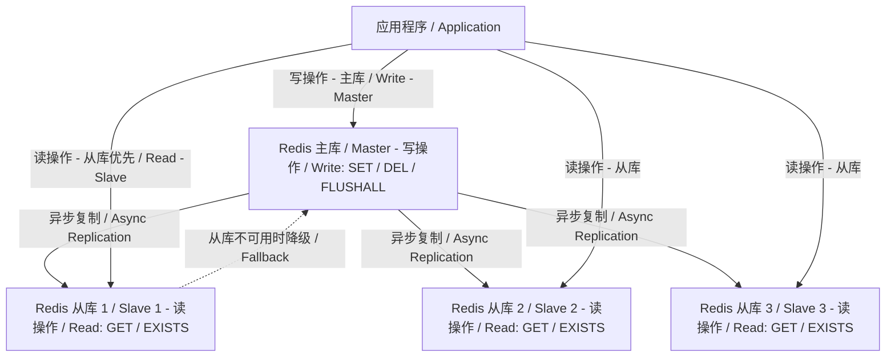
```mermaid
flowchart TB
    Master["Redis 主库 / Master - 写操作 / Write: SET / DEL / FLUSHALL"]

    Master -->|"异步复制 / Async Replication"| Slave1["Redis 从库 1 / Slave 1 - 读操作 / Read: GET / EXISTS"]
    Master -->|"异步复制 / Async Replication"| Slave2["Redis 从库 2 / Slave 2 - 读操作 / Read: GET / EXISTS"]
    Master -->|"异步复制 / Async Replication"| Slave3["Redis 从库 3 / Slave 3 - 读操作 / Read: GET / EXISTS"]

    App["应用程序 / Application"] -->|"写操作 - 主库 / Write - Master"| Master
    App -->|"读操作 - 从库优先 / Read - Slave"| Slave1
    App -->|"读操作 - 从库"| Slave2
    App -->|"读操作 - 从库"| Slave3
    Slave1 -.->|"从库不可用时降级 / Fallback"| Master
```

#### MySQL vs Redis 主从策略对比 / Strategy Comparison

| 对比项 / Comparison | MySQL 主从 | Redis 主从 |
|------|------|------|
| 复制方式 / Replication Mode | 半同步复制 / Semi-Sync | 异步复制 + WAIT / Async + WAIT |
| 一致性保障 / Consistency | rpl_semi_sync 等待从库 ACK | WAIT 命令等待 N 个从库确认 |
| 故障转移选主 / Failover Selection | 复制延迟最小 / Minimum Lag | 复制偏移量最大 / Maximum Offset |
| 健康检查 / Health Check | `mysql_ping()` | `PING` 命令 |
| 数据备份 / Backup | `mysqldump` 逻辑备份 | `BGSAVE` RDB 快照 |
| 延迟监控 / Lag Monitor | `SHOW SLAVE STATUS` | `INFO replication` |
| 读写分离 / RWS | GetSlaveConnection() 轮询 | GetSlaveConnection() 轮询 |
| 降级策略 / Fallback | 从库不可用 - 主库 | 从库不可用 - 主库 |

#### 连接池架构 / Connection Pool Architecture

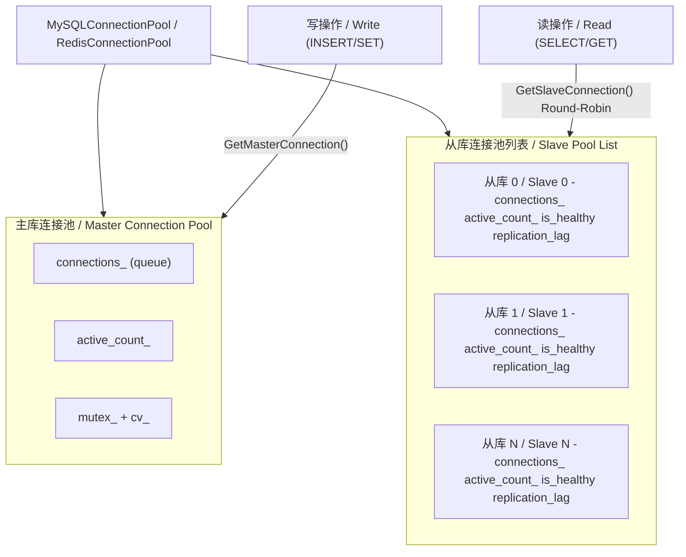
```mermaid
flowchart TB
    Pool["MySQLConnectionPool / RedisConnectionPool"]

    subgraph MasterPool["主库连接池 / Master Connection Pool"]
        MConn["connections_ (queue)"]
        MActive["active_count_"]
        MMutex["mutex_ + cv_"]
    end

    subgraph SlavePools["从库连接池列表 / Slave Pool List"]
        SP1["从库 0 / Slave 0 - connections_ active_count_ is_healthy replication_lag"]
        SP2["从库 1 / Slave 1 - connections_ active_count_ is_healthy replication_lag"]
        SPN["从库 N / Slave N - connections_ active_count_ is_healthy replication_lag"]
    end

    Pool --> MasterPool
    Pool --> SlavePools

    AppWrite["写操作 / Write (INSERT/SET)"] -->|"GetMasterConnection()"| MasterPool
    AppRead["读操作 / Read (SELECT/GET)"] -->|"GetSlaveConnection() Round-Robin"| SlavePools
```

### 性能优化 / Performance Optimization

#### 智能传输优化 / Smart Transfer Optimization

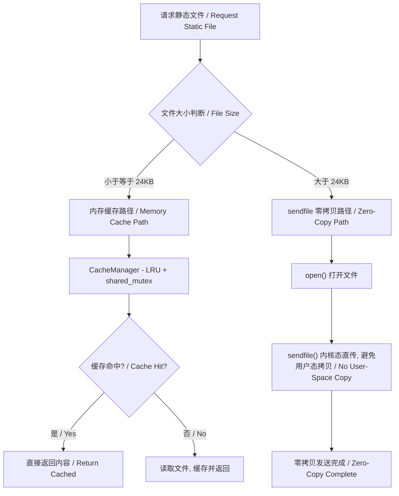
```mermaid
flowchart TD
    A["请求静态文件 / Request Static File"] --> B{"文件大小判断 / File Size"}
    B -->|"小于等于 24KB"| C["内存缓存路径 / Memory Cache Path"]
    B -->|"大于 24KB"| D["sendfile 零拷贝路径 / Zero-Copy Path"]

    C --> C1["CacheManager - LRU + shared_mutex"]
    C1 --> C2{"缓存命中? / Cache Hit?"}
    C2 -->|"是 / Yes"| C3["直接返回内容 / Return Cached"]
    C2 -->|"否 / No"| C4["读取文件, 缓存并返回"]

    D --> D1["open() 打开文件"]
    D1 --> D2["sendfile() 内核态直传, 避免用户态拷贝 / No User-Space Copy"]
    D2 --> D3["零拷贝发送完成 / Zero-Copy Complete"]
```

#### 零拷贝 vs 传统拷贝 / Zero-Copy vs Traditional Copy

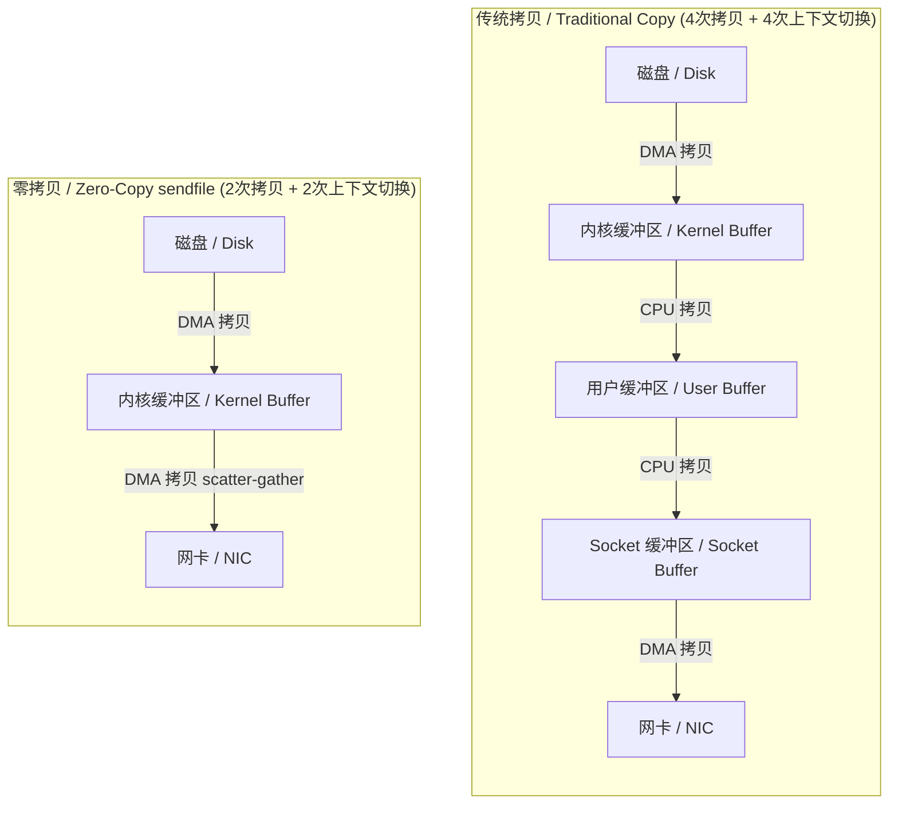
```mermaid
flowchart TB
    subgraph Traditional["传统拷贝 / Traditional Copy (4次拷贝 + 4次上下文切换)"]
        direction TB
        T1["磁盘 / Disk"] -->|"DMA 拷贝"| T2["内核缓冲区 / Kernel Buffer"]
        T2 -->|"CPU 拷贝"| T3["用户缓冲区 / User Buffer"]
        T3 -->|"CPU 拷贝"| T4["Socket 缓冲区 / Socket Buffer"]
        T4 -->|"DMA 拷贝"| T5["网卡 / NIC"]
    end

    subgraph ZeroCopy["零拷贝 / Zero-Copy sendfile (2次拷贝 + 2次上下文切换)"]
        direction TB
        Z1["磁盘 / Disk"] -->|"DMA 拷贝"| Z2["内核缓冲区 / Kernel Buffer"]
        Z2 -->|"DMA 拷贝 scatter-gather"| Z3["网卡 / NIC"]
    end
```

| 对比项 / Comparison | 传统 read+write | sendfile 零拷贝 |
|------|------|------|
| 数据拷贝次数 / Copy Count | 4 次 | 2 次 |
| 上下文切换 / Context Switch | 4 次 | 2 次 |
| CPU 参与 / CPU Involvement | 2 次 CPU 拷贝 | 0 次 CPU 拷贝 |
| 适用场景 / Use Case | 需要修改数据 | 大文件直传 |

#### LRU 缓存淘汰机制 / LRU Cache Eviction

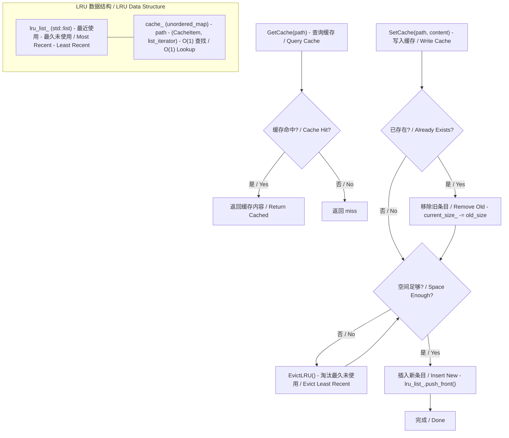
```mermaid
flowchart TD
    GetCache["GetCache(path) - 查询缓存 / Query Cache"] --> Hit{"缓存命中? / Cache Hit?"}
    Hit -->|"是 / Yes"| Return["返回缓存内容 / Return Cached"]
    Hit -->|"否 / No"| Miss["返回 miss"]

    SetCache["SetCache(path, content) - 写入缓存 / Write Cache"] --> Exists{"已存在? / Already Exists?"}
    Exists -->|"是 / Yes"| RemoveOld["移除旧条目 / Remove Old - current_size_ -= old_size"]
    Exists -->|"否 / No"| CheckSpace{"空间足够? / Space Enough?"}
    RemoveOld --> CheckSpace

    CheckSpace -->|"否 / No"| Evict["EvictLRU() - 淘汰最久未使用 / Evict Least Recent"]
    CheckSpace -->|"是 / Yes"| Insert["插入新条目 / Insert New - lru_list_.push_front()"]
    Evict --> CheckSpace

    Insert --> Done["完成 / Done"]

    subgraph LRUStructure["LRU 数据结构 / LRU Data Structure"]
        direction LR
        List["lru_list_ (std::list) - 最近使用 - 最久未使用 / Most Recent - Least Recent"]
        Map["cache_ (unordered_map) - path - (CacheItem, list_iterator) - O(1) 查找 / O(1) Lookup"]
    end

    List --- Map
```

**线程安全 / Thread Safety**：使用 `std::shared_mutex` 实现读写锁
- 读操作 (GetCache)：`shared_lock`，允许多线程并发读
- 写操作 (SetCache/ClearCache)：`unique_lock`，独占写入

### 协议与安全 / Protocol & Security

#### HTTP 有限状态机解析 / HTTP FSM Parsing

HTTP 请求解析器使用有限状态机 (FSM) 逐步解析请求，支持粘包处理：

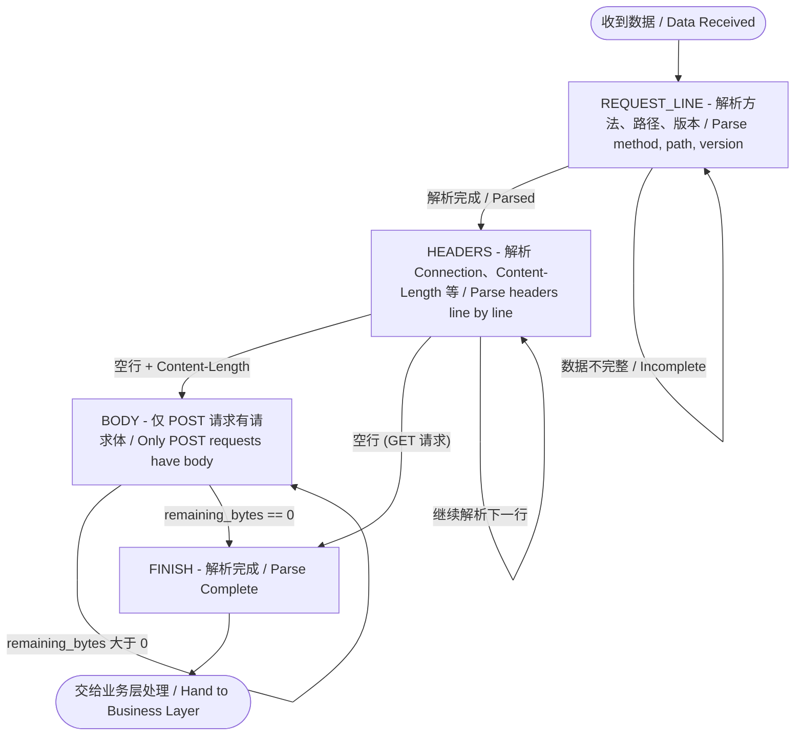
```mermaid
flowchart TD
    Start(["收到数据 / Data Received"]) --> REQUEST_LINE["REQUEST_LINE - 解析方法、路径、版本 / Parse method, path, version"]

    REQUEST_LINE -->|"解析完成 / Parsed"| HEADERS["HEADERS - 解析 Connection、Content-Length 等 / Parse headers line by line"]
    REQUEST_LINE -->|"数据不完整 / Incomplete"| REQUEST_LINE

    HEADERS -->|"空行 + Content-Length"| BODY["BODY - 仅 POST 请求有请求体 / Only POST requests have body"]
    HEADERS -->|"空行 (GET 请求)"| FINISH["FINISH - 解析完成 / Parse Complete"]
    HEADERS -->|"继续解析下一行"| HEADERS

    BODY -->|"remaining_bytes 大于 0"| BODY
    BODY -->|"remaining_bytes == 0"| FINISH

    FINISH --> Done(["交给业务层处理 / Hand to Business Layer"])
```

**粘包处理 / TCP Sticky Packet Handling**：

由于 TCP 是流式协议，一次 `read()` 可能包含多个请求或不完整的请求。解析器通过 `remaining_data_` 缓冲区处理：
- 解析完一个请求后，检查缓冲区是否还有剩余数据
- 若有，继续解析下一个请求（循环解析）
- 若数据不完整，保存到 `remaining_data_`，等待下次 `EPOLLIN` 事件补充数据

#### 安全认证流程 / Security Authentication Flow


```mermaid
flowchart TD
    subgraph Register["注册流程 / Registration Flow"]
        R1["POST /register"] --> R2["SHA256(password) - 密码哈希 / Password Hashing"]
        R2 --> R3["参数化 INSERT / Parameterized INSERT - INSERT IGNORE INTO users"]
        R3 --> R4{"插入成功? / Success?"}
        R4 -->|"是 / Yes"| R5["返回成功"]
        R4 -->|"否 / No"| R6["用户已存在"]
    end

    subgraph Login["登录流程 / Login Flow"]
        L1["POST /login"] --> L2["Redis 缓存查询 - GET user:username"]
        L2 --> L3{"缓存命中? / Cache Hit?"}
        L3 -->|"是 / Yes"| L5["SHA256(password) - 与缓存哈希比对"]
        L3 -->|"否 / No"| L4["MySQL 从库查询 - 参数化 SELECT"]
        L4 --> L4b["写入 Redis 缓存 - SET user:username hash 3600"]
        L4b --> L5
        L5 --> L6{"哈希匹配? / Match?"}
        L6 -->|"是 / Yes"| L7["生成 Session ID - 随机 32 位 / Random 32-char"]
        L6 -->|"否 / No"| L8["返回认证失败"]
        L7 --> L9["返回 Session ID - 1 小时有效期 / 1-hour TTL"]
    end
```

**安全设计总览 / Security Design Overview**：

| 安全措施 / Measure | 实现方式 / Implementation | 防御目标 / Defense Target |
|------|------|------|
| 密码加密 / Password Encryption | SHA256 哈希存储 / Hashed storage | 防止密码泄露 / Prevent password leak |
| SQL 注入防护 / SQL Injection Defense | 参数化查询 / Parameterized Query | 防止 SQL 注入 / Prevent SQL injection |
| 连接池隔离 / Pool Isolation | 每个连接独立 / Independent per connection | 防止状态串扰 / Prevent state leakage |
| 会话安全 / Session Security | 随机 32 位 ID + 1 小时过期 / Random 32-char + 1h TTL | 防止会话劫持 / Prevent session hijacking |

### 设计模式与监控 / Design Patterns & Monitoring

#### 设计模式总览 / Design Patterns Overview

| 模式 / Pattern | 应用位置 / Where Used | 解决的问题 / Problem Solved |
|------|------|------|
| Reactor / 反应器 | EventLoop + Epoller + Channel | IO 多路复用 + 事件驱动，避免线程阻塞 |
| Master-Slave Reactor / 主从反应器 | Server + Acceptor + ThreadPool | 连接接受与 IO 处理分离，提高扩展性 |
| Singleton / 单例 | 连接池、MetricsCollector、RedisCache | 全局唯一实例，统一资源管理 |
| Facade / 外观 | RedisCache 封装 RedisConnectionPool | 简化接口，隐藏底层复杂性 |
| One Loop Per Thread | EventLoopThreadPool | 线程间无锁竞争，最大化并发性能 |
| Producer-Consumer / 生产者-消费者 | 主 Reactor - 从 Reactor | 连接分发与 IO 处理解耦 |

#### 监控数据流 / Monitoring Data Flow

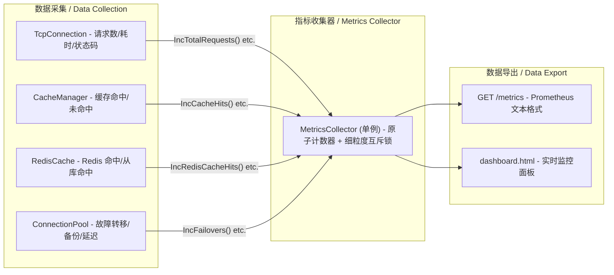
```mermaid
flowchart LR
    subgraph Sources["数据采集 / Data Collection"]
        S1["TcpConnection - 请求数/耗时/状态码"]
        S2["CacheManager - 缓存命中/未命中"]
        S3["RedisCache - Redis 命中/从库命中"]
        S4["ConnectionPool - 故障转移/备份/延迟"]
    end

    subgraph Collector["指标收集器 / Metrics Collector"]
        MC["MetricsCollector (单例) - 原子计数器 + 细粒度互斥锁"]
    end

    subgraph Export["数据导出 / Data Export"]
        EP["GET /metrics - Prometheus 文本格式"]
        Dash["dashboard.html - 实时监控面板"]
    end

    S1 -->|"IncTotalRequests() etc."| MC
    S2 -->|"IncCacheHits() etc."| MC
    S3 -->|"IncRedisCacheHits() etc."| MC
    S4 -->|"IncFailovers() etc."| MC

    MC --> EP
    MC --> Dash
```

## 系统交互时序图 / Sequence Diagrams

### HTTP 请求处理时序 / HTTP Request Processing

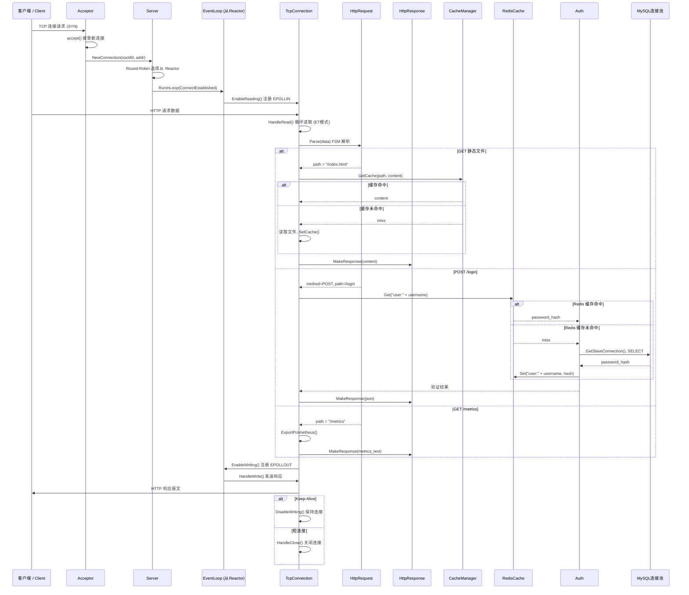
```mermaid
sequenceDiagram
    participant C as 客户端 / Client
    participant A as Acceptor
    participant S as Server
    participant EL as EventLoop (从Reactor)
    participant TC as TcpConnection
    participant HR as HttpRequest
    participant HP as HttpResponse
    participant CM as CacheManager
    participant RC as RedisCache
    participant AU as Auth
    participant DB as MySQL连接池

    C->>A: TCP 连接请求 (SYN)
    A->>A: accept() 接受新连接
    A->>S: NewConnection(sockfd, addr)
    S->>S: Round-Robin 选择从 Reactor
    S->>EL: RunInLoop(ConnectEstablished)
    EL->>TC: EnableReading() 注册 EPOLLIN

    C->>TC: HTTP 请求数据
    TC->>TC: HandleRead() 循环读取 (ET模式)
    TC->>HR: Parse(data) FSM 解析

    alt GET 静态文件
        HR-->>TC: path = "/index.html"
        TC->>CM: GetCache(path, content)
        alt 缓存命中
            CM-->>TC: content
        else 缓存未命中
            CM-->>TC: miss
            TC->>TC: 读取文件, SetCache()
        end
        TC->>HP: MakeResponse(content)
    else POST /login
        HR-->>TC: method=POST, path=/login
        TC->>RC: Get("user:" + username)
        alt Redis 缓存命中
            RC-->>AU: password_hash
        else Redis 缓存未命中
            RC-->>AU: miss
            AU->>DB: GetSlaveConnection(), SELECT
            DB-->>AU: password_hash
            AU->>RC: Set("user:" + username, hash)
        end
        AU-->>TC: 验证结果
        TC->>HP: MakeResponse(json)
    else GET /metrics
        HR-->>TC: path = "/metrics"
        TC->>TC: ExportPrometheus()
        TC->>HP: MakeResponse(metrics_text)
    end

    TC->>EL: EnableWriting() 注册 EPOLLOUT
    EL->>TC: HandleWrite() 发送响应
    TC->>C: HTTP 响应报文

    alt Keep-Alive
        TC->>TC: DisableWriting() 保持连接
    else 短连接
        TC->>TC: HandleClose() 关闭连接
    end
```

### 故障转移时序 / Failover Sequence

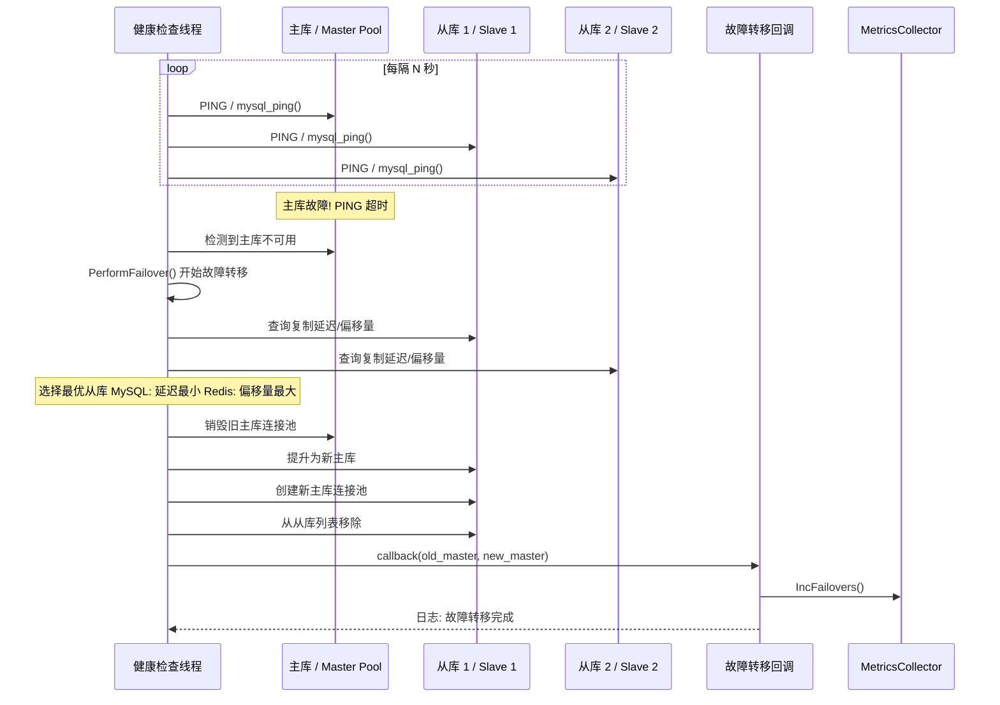
```mermaid
sequenceDiagram
    participant HC as 健康检查线程
    participant MP as 主库 / Master Pool
    participant SP1 as 从库 1 / Slave 1
    participant SP2 as 从库 2 / Slave 2
    participant CB as 故障转移回调
    participant MC as MetricsCollector

    loop 每隔 N 秒
        HC->>MP: PING / mysql_ping()
        HC->>SP1: PING / mysql_ping()
        HC->>SP2: PING / mysql_ping()
    end

    Note over MP: 主库故障! PING 超时

    HC->>MP: 检测到主库不可用
    HC->>HC: PerformFailover() 开始故障转移

    HC->>SP1: 查询复制延迟/偏移量
    HC->>SP2: 查询复制延迟/偏移量

    Note over HC: 选择最优从库 MySQL: 延迟最小 Redis: 偏移量最大

    HC->>MP: 销毁旧主库连接池
    HC->>SP1: 提升为新主库
    HC->>SP1: 创建新主库连接池
    HC->>SP1: 从从库列表移除

    HC->>CB: callback(old_master, new_master)
    CB->>MC: IncFailovers()
    CB-->>HC: 日志: 故障转移完成
```

## 核心类图 / Class Diagram

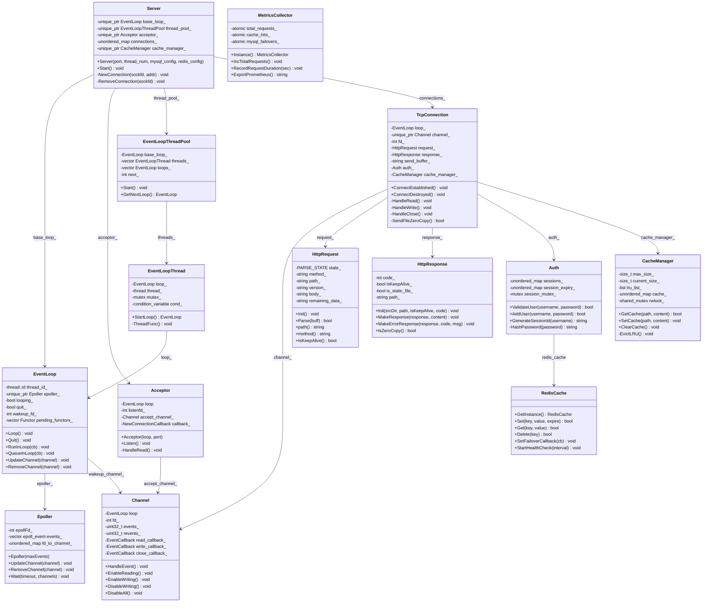
```mermaid
classDiagram
    direction TB

    class Server {
        -unique_ptr EventLoop base_loop_
        -unique_ptr EventLoopThreadPool thread_pool_
        -unique_ptr Acceptor acceptor_
        -unordered_map connections_
        -unique_ptr CacheManager cache_manager_
        +Server(port, thread_num, mysql_config, redis_config)
        +Start() void
        -NewConnection(sockfd, addr) void
        -RemoveConnection(sockfd) void
    }

    class EventLoop {
        -thread::id thread_id_
        -unique_ptr Epoller epoller_
        -bool looping_
        -bool quit_
        -int wakeup_fd_
        -vector Functor pending_functors_
        +Loop() void
        +Quit() void
        +RunInLoop(cb) void
        +QueueInLoop(cb) void
        +UpdateChannel(channel) void
        +RemoveChannel(channel) void
    }

    class Epoller {
        -int epollFd_
        -vector epoll_event events_
        -unordered_map fd_to_channel_
        +Epoller(maxEvents)
        +UpdateChannel(channel) void
        +RemoveChannel(channel) void
        +Wait(timeout, channels) void
    }

    class Channel {
        -EventLoop loop
        -int fd_
        -uint32_t events_
        -uint32_t revents_
        -EventCallback read_callback_
        -EventCallback write_callback_
        -EventCallback close_callback_
        +HandleEvent() void
        +EnableReading() void
        +EnableWriting() void
        +DisableWriting() void
        +DisableAll() void
    }

    class Acceptor {
        -EventLoop loop
        -int listenfd_
        -Channel accept_channel_
        -NewConnectionCallback callback_
        +Acceptor(loop, port)
        +Listen() void
        -HandleRead() void
    }

    class EventLoopThreadPool {
        -EventLoop base_loop_
        -vector EventLoopThread threads_
        -vector EventLoop loops_
        -int next_
        +Start() void
        +GetNextLoop() EventLoop
    }

    class EventLoopThread {
        -EventLoop loop_
        -thread thread_
        -mutex mutex_
        -condition_variable cond_
        +StartLoop() EventLoop
        -ThreadFunc() void
    }

    class TcpConnection {
        -EventLoop loop_
        -unique_ptr Channel channel_
        -int fd_
        -HttpRequest request_
        -HttpResponse response_
        -string send_buffer_
        -Auth auth_
        -CacheManager cache_manager_
        +ConnectEstablished() void
        +ConnectDestroyed() void
        -HandleRead() void
        -HandleWrite() void
        -HandleClose() void
        -SendFileZeroCopy() bool
    }

    class HttpRequest {
        -PARSE_STATE state_
        -string method_
        -string path_
        -string version_
        -string body_
        -string remaining_data_
        +Init() void
        +Parse(buff) bool
        +path() string
        +method() string
        +IsKeepAlive() bool
    }

    class HttpResponse {
        -int code_
        -bool isKeepAlive_
        -bool is_static_file_
        -string path_
        +Init(srcDir, path, isKeepAlive, code) void
        +MakeResponse(response, content) void
        +MakeErrorResponse(response, code, msg) void
        +IsZeroCopy() bool
    }

    class Auth {
        -unordered_map sessions_
        -unordered_map session_expiry_
        -mutex session_mutex_
        +ValidateUser(username, password) bool
        +AddUser(username, password) bool
        +GenerateSessionId(username) string
        -HashPassword(password) string
    }

    class CacheManager {
        -size_t max_size_
        -size_t current_size_
        -list lru_list_
        -unordered_map cache_
        -shared_mutex rwlock_
        +GetCache(path, content) bool
        +SetCache(path, content) void
        +ClearCache() void
        -EvictLRU() void
    }

    class RedisCache {
        +GetInstance() RedisCache
        +Set(key, value, expire) bool
        +Get(key, value) bool
        +Delete(key) bool
        +SetFailoverCallback(cb) void
        +StartHealthCheck(interval) void
    }

    class MetricsCollector {
        -atomic total_requests_
        -atomic cache_hits_
        -atomic mysql_failovers_
        +Instance() MetricsCollector
        +IncTotalRequests() void
        +RecordRequestDuration(sec) void
        +ExportPrometheus() string
    }

    Server --> EventLoop : base_loop_
    Server --> Acceptor : acceptor_
    Server --> EventLoopThreadPool : thread_pool_
    Server --> TcpConnection : connections_

    EventLoop --> Epoller : epoller_
    EventLoop --> Channel : wakeup_channel_

    Acceptor --> Channel : accept_channel_

    EventLoopThreadPool --> EventLoopThread : threads_
    EventLoopThread --> EventLoop : loop_

    TcpConnection --> Channel : channel_
    TcpConnection --> HttpRequest : request_
    TcpConnection --> HttpResponse : response_
    TcpConnection --> Auth : auth_
    TcpConnection --> CacheManager : cache_manager_

    Auth --> RedisCache : redis_cache
```

## 程序运行流程图 / Program Flow

### 服务器启动流程 / Server Startup


```mermaid
flowchart TD
    Start(["程序入口 main()"]) --> ParseArgs["解析命令行参数 - 端口 / IO线程数 / MySQL配置"]
    ParseArgs --> CalcThreads{"IO线程数 小于等于 0?"}
    CalcThreads -->|"是"| AutoThread["自动计算: CPU核心数 x 2"]
    CalcThreads -->|"否"| UseArg["使用指定线程数"]
    AutoThread --> CreateServer["创建 Server 对象"]
    UseArg --> CreateServer

    CreateServer --> InitBaseLoop["初始化主 Reactor EventLoop()"]
    InitBaseLoop --> InitThreadPool["创建 IO 线程池"]
    InitThreadPool --> InitAcceptor["创建 Acceptor - socket, bind, listen"]
    InitAcceptor --> InitCache["初始化 CacheManager (LRU)"]

    InitCache --> InitMySQL["初始化 MySQL 连接池"]
    InitMySQL --> HasMySQLSlaves{"配置了 MySQL 从库?"}
    HasMySQLSlaves -->|"是"| InitMySQLSlave["InitializeWithSlaves() - 启用半同步复制"]
    HasMySQLSlaves -->|"否"| InitMySQLSingle["Initialize() 单机模式"]
    InitMySQLSlave --> InitMySQLHealth["启动 MySQL 健康检查线程"]
    InitMySQLSingle --> InitMySQLHealth

    InitMySQLHealth --> InitRedis["初始化 Redis 连接池"]
    InitRedis --> HasRedisSlaves{"配置了 Redis 从库?"}
    HasRedisSlaves -->|"是"| InitRedisSlave["InitializeWithSlaves()"]
    HasRedisSlaves -->|"否"| InitRedisSingle["Initialize() 单机模式"]
    InitRedisSlave --> InitRedisHealth["启动 Redis 健康检查线程"]
    InitRedisSingle --> InitRedisHealth

    InitRedisHealth --> StartThreadPool["启动 IO 线程池"]
    StartThreadPool --> StartListen["Acceptor::Listen() 注册 listenfd"]
    StartListen --> MainLoop["主 Reactor 事件循环 Loop()"]

    MainLoop --> WaitEvent["epoll_wait()"]
    WaitEvent --> HasConn{"新连接?"}
    HasConn -->|"是"| Accept["accept() 接受连接"]
    Accept --> Distribute["Round-Robin 分配到从 Reactor"]
    Distribute --> CreateConn["创建 TcpConnection"]
    CreateConn --> WaitEvent
    HasConn -->|"否"| WaitEvent
```

### HTTP 请求处理流程 / HTTP Request Processing

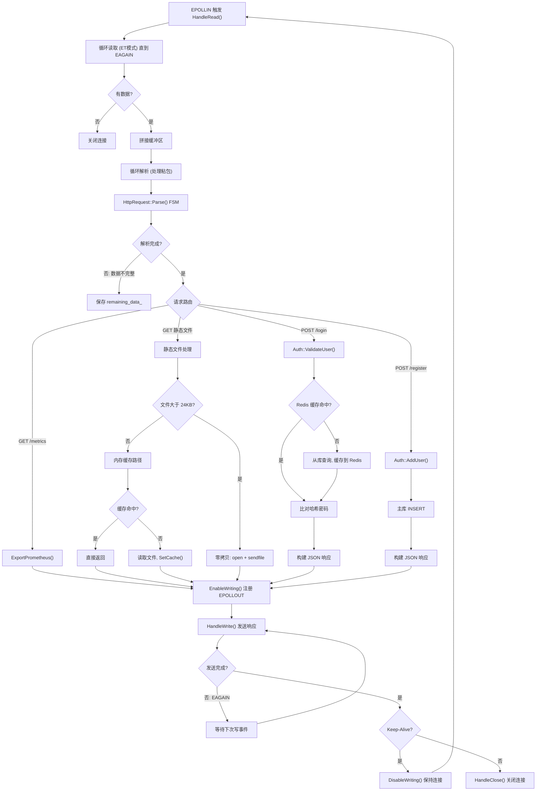
```mermaid
flowchart TD
    EPOLLIN["EPOLLIN 触发 HandleRead()"] --> LoopRead["循环读取 (ET模式) 直到 EAGAIN"]
    LoopRead --> HasData{"有数据?"}
    HasData -->|"否"| CloseConn["关闭连接"]
    HasData -->|"是"| AppendBuf["拼接缓冲区"]

    AppendBuf --> ParseLoop["循环解析 (处理粘包)"]
    ParseLoop --> ParseHTTP["HttpRequest::Parse() FSM"]
    ParseHTTP --> ParseOK{"解析完成?"}
    ParseOK -->|"否: 数据不完整"| WaitMore["保存 remaining_data_"]
    ParseOK -->|"是"| Route{"请求路由"}

    Route -->|"GET /metrics"| MetricsRoute["ExportPrometheus()"]
    Route -->|"POST /login"| Login["Auth::ValidateUser()"]
    Route -->|"POST /register"| Register["Auth::AddUser()"]
    Route -->|"GET 静态文件"| StaticFile["静态文件处理"]

    StaticFile --> CheckSize{"文件大于 24KB?"}
    CheckSize -->|"是"| ZeroCopy["零拷贝: open + sendfile"]
    CheckSize -->|"否"| MemCache["内存缓存路径"]

    MemCache --> CacheHit{"缓存命中?"}
    CacheHit -->|"是"| ReturnCache["直接返回"]
    CacheHit -->|"否"| ReadFile["读取文件, SetCache()"]

    Login --> CheckRedis{"Redis 缓存命中?"}
    CheckRedis -->|"是"| ValidateHash["比对哈希密码"]
    CheckRedis -->|"否"| QueryDB["从库查询, 缓存到 Redis"]
    QueryDB --> ValidateHash
    ValidateHash --> BuildJSON["构建 JSON 响应"]

    Register --> InsertDB["主库 INSERT"]
    InsertDB --> BuildJSON2["构建 JSON 响应"]

    MetricsRoute --> EnableWrite
    ReturnCache --> EnableWrite
    ReadFile --> EnableWrite
    ZeroCopy --> EnableWrite
    BuildJSON --> EnableWrite
    BuildJSON2 --> EnableWrite

    EnableWrite["EnableWriting() 注册 EPOLLOUT"] --> SendResponse["HandleWrite() 发送响应"]
    SendResponse --> SendDone{"发送完成?"}
    SendDone -->|"否: EAGAIN"| WaitWrite["等待下次写事件"]
    SendDone -->|"是"| KeepAlive{"Keep-Alive?"}
    KeepAlive -->|"是"| DisableWrite["DisableWriting() 保持连接"]
    KeepAlive -->|"否"| CloseConn2["HandleClose() 关闭连接"]

    WaitWrite --> SendResponse
    DisableWrite --> EPOLLIN
```

## API 接口文档 / API Documentation

### HTTP 接口

| 方法 / Method | 路径 / Path | 说明 / Description | 请求体 / Request Body | 响应格式 / Response |
|------|------|------|--------|----------|
| GET | `/` | 登录页面 / Login Page | - | HTML |
| GET | `/welcome.html` | 欢迎页面 / Welcome Page | - | HTML |
| GET | `/dashboard.html` | 监控面板 / Dashboard | - | HTML |
| GET | `/metrics` | Prometheus 指标 / Metrics | - | text/plain |
| POST | `/login` | 用户登录 / User Login | `username=xxx&password=xxx` | JSON |
| POST | `/register` | 用户注册 / User Registration | `username=xxx&password=xxx` | JSON |

### 登录接口 / Login API

**请求 / Request**：

```http
POST /login HTTP/1.1
Content-Type: application/x-www-form-urlencoded

username=admin&password=123456
```

**成功响应 / Success**：

```json
{
  "success": true,
  "message": "登录成功",
  "session_id": "a1b2c3d4e5f6..."
}
```

**失败响应 / Failure**：

```json
{
  "success": false,
  "message": "用户名或密码错误"
}
```

### 注册接口 / Register API

**请求 / Request**：

```http
POST /register HTTP/1.1
Content-Type: application/x-www-form-urlencoded

username=newuser&password=mypassword
```

**成功响应 / Success**：

```json
{
  "success": true,
  "message": "注册成功"
}
```

**失败响应 / Failure**：

```json
{
  "success": false,
  "message": "注册失败，用户名可能已存在"
}
```

### Prometheus 监控指标 / Prometheus Metrics

访问 `GET /metrics` 可获取以下指标：

| 指标名称 / Metric Name | 类型 / Type | 说明 / Description |
|----------|------|------|
| `http_requests_total` | Counter | HTTP 请求总数 / Total HTTP requests |
| `http_requests_by_method` | Counter | 按方法分类的请求数 / Requests by method |
| `http_requests_by_path` | Counter | 按路径分类的请求数 / Requests by path |
| `http_responses_by_status` | Counter | 按状态码分类的响应数 / Responses by status code |
| `http_request_duration_seconds` | Histogram | 请求耗时分布 / Request duration distribution |
| `http_active_connections` | Gauge | 当前活跃连接数 / Active connections |
| `cache_hits_total` / `cache_misses_total` | Counter | 缓存命中/未命中数 / Cache hits/misses |
| `memory_cache_hits_total` | Counter | 内存缓存命中数 / Memory cache hits |
| `redis_cache_hits_total` | Counter | Redis 缓存命中数 / Redis cache hits |
| `redis_slave_hits_total` | Counter | Redis 从库命中数 / Redis slave hits |
| `mysql_slave_hits_total` | Counter | MySQL 从库命中数 / MySQL slave hits |
| `mysql_slave_replication_lag_ms` | Gauge | MySQL 从库复制延迟 / MySQL replication lag |
| `mysql_failovers_total` | Counter | MySQL 故障转移次数 / MySQL failover count |
| `redis_failovers_total` | Counter | Redis 故障转移次数 / Redis failover count |

## 性能压测 / Performance Benchmark

### 静态资源压测结果 / Static Resource Benchmark

| 文件名称 / File | 大小 / Size | QPS | 带宽 / Bandwidth | 传输方式 / Transfer Mode |
|----------|------|-----|------|----------|
| welcome.html | 小文件 / Small | 145,484 | 146MB/s | 内存缓存 / Memory Cache |
| index.html | 小文件 / Small | 102,820 | 1.06GB/s | 内存缓存 / Memory Cache |
| 1mb.bin | 1MB | 12,486 | 12.20GB/s | sendfile 零拷贝 / Zero-Copy |
| 10mb.bin | 10MB | 1,135 | 11.10GB/s | sendfile 零拷贝 / Zero-Copy |

### 认证功能压测结果 / Auth Benchmark

| 测试阶段 / Test | 线程数 / Threads | 并发数 / Concurrency | QPS | 平均延迟 / Avg Latency |
|----------|--------|--------|-----|----------|
| 标准-登录 / Standard Login | 12 | 200 | 6,921 | 42.89ms |
| 标准-注册 / Standard Register | 12 | 200 | 1,050 | 166.74ms |
| 极限-登录 / Extreme Login | 24 | 500 | 7,110 | 70.32ms |

**Redis 缓存效果 / Redis Cache Effect**：登录 QPS 从 1,045 提升到 7,110，**提升 6.8 倍 / 6.8x improvement**

## 技术术语表 / Technology Glossary

| 中文术语 | English Term | 缩写 | 说明 |
|----------|-------------|------|------|
| 反应器模式 | Reactor Pattern | - | 事件驱动的 IO 多路复用设计模式，将事件分发到对应的处理器 |
| 主从反应器 | Master-Slave Reactor | - | 主 Reactor 负责接受连接，从 Reactor 负责处理 IO，职责分离 |
| 事件循环 | Event Loop | - | 持续监听并分发 IO 事件的循环结构，一个线程一个循环 |
| 边缘触发 | Edge Triggered | ET | epoll 仅在状态变化时通知一次，需一次性读完/写完所有数据 |
| 水平触发 | Level Triggered | LT | epoll 在数据未处理完时持续通知，编程简单但效率较低 |
| IO 多路复用 | IO Multiplexing | - | 单线程同时监听多个文件描述符的 IO 就绪状态 |
| 读写分离 | Read-Write Splitting | RWS | 写操作走主库，读操作走从库，分散压力 |
| 半同步复制 | Semi-Synchronous Replication | - | 主库写操作等待至少一个从库确认收到 binlog 后才返回 |
| 故障转移 | Failover | - | 主库故障时自动将最优从库提升为新主库的过程 |
| 零拷贝 | Zero-Copy | - | 数据在内核态直接传输，避免内核态与用户态的内存拷贝 |
| 连接池 | Connection Pool | - | 预创建并复用数据库连接，避免频繁创建/销毁连接的开销 |
| 有限状态机 | Finite State Machine | FSM | HTTP 解析器使用状态机逐步解析请求行、头部、请求体 |
| 粘包处理 | TCP Sticky Packet | - | TCP 流式传输中，多次请求的数据可能合并到达，需正确拆分 |
| LRU 淘汰 | Least Recently Used | LRU | 缓存满时优先淘汰最久未使用的数据项 |
| 外观模式 | Facade Pattern | - | 为复杂子系统提供简化接口（如 RedisCache 封装 RedisConnectionPool） |
| 单例模式 | Singleton Pattern | - | 确保一个类只有一个实例（如 MetricsCollector、连接池） |
| 轮询负载均衡 | Round-Robin Load Balancing | - | 按顺序依次将请求分配到各从库，实现均匀分布 |
| 复制偏移量 | Replication Offset | - | Redis 从库已接收的主库数据位置，偏移量越大数据越完整 |
| 复制延迟 | Replication Lag | - | 从库数据落后主库的时间差，延迟越大数据越不新鲜 |
| Prometheus 格式 | Prometheus Exposition Format | - | 监控指标的标准文本格式，被 Grafana 等工具广泛支持 |

## 扩展方向 / Future Directions

- 📝 支持 JSON 请求体解析 / Support JSON request body (`application/json`)
- 🔒 支持 HTTPS / Support HTTPS (OpenSSL integration)
- 🐳 容器化部署支持 / Containerization (Docker + Docker Compose)
- 🚀 支持 HTTP/2 协议 / Support HTTP/2 protocol
- 📦 配置文件支持 / Config file support (YAML/JSON instead of CLI args)
- 🔗 限流与熔断机制 / Rate limiting and circuit breaking
