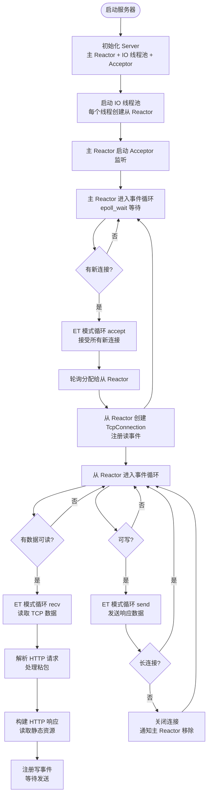

# WebServer-Reactor

基于 C++11 实现的**主从 Reactor 模式**高并发 Web 服务器，采用完全工程化结构设计，支持 HTTP/1.1 基础协议、长连接与静态资源服务，是学习网络编程与 Reactor 架构的优质实践项目。

## 核心特性

| 特性 | 说明 |
|------|------|
| 🎯 **标准主从 Reactor 架构** | 主 Reactor 仅负责连接接受，从 Reactor 负责 IO 事件处理，职责清晰 |
| 🧵 **One Loop Per Thread** | 每个 IO 线程绑定独立 EventLoop，线程间无锁竞争，并发性能优异 |
| ⚡ **高性能 IO 模型** | Epoll 边缘触发 (ET) + 非阻塞 Socket + TCP_NODELAY，降低延迟与系统调用 |
| 🏗️ **工程化结构设计** | 模块化分层 (net/http/server)、CMake 构建、统一 reactor 命名空间 |
| 🌐 **完整 HTTP 支持** | GET 请求解析、长连接 (Keep-Alive)、TCP 粘包处理、静态资源响应 |

## 项目结构

```
WebServer-Reactor/
├── include/          # 头文件目录
│   ├── net/          # 网络层 (EventLoop/Channel/Epoller/Acceptor)
│   ├── http/         # HTTP 层 (HttpRequest/HttpResponse)
│   └── server/       # 服务器层 (Server/TcpConnection)
├── src/              # 源文件目录
│   ├── net/
│   ├── http/
│   ├── server/
│   └── main.cpp      # 程序入口
├── www/              # 静态资源目录 (index.html等)
└── CMakeLists.txt    # CMake 构建配置
```

## 核心原理解析

### 1. 主从 Reactor 模式
Reactor 模式是一种**事件驱动**的网络编程模式，核心思想是将 IO 事件与业务处理分离：
- **主 Reactor (Base Reactor)**：仅负责监听端口，通过 `accept()` 接受新连接，不处理具体 IO
- **从 Reactor (IO Reactor)**：负责已建立连接的 IO 事件处理（读/写/关闭）
- **线程池**：管理多个从 Reactor，通过轮询 (Round-Robin) 分配新连接，实现负载均衡

### 2. One Loop Per Thread
- 每个线程（包括主线程和 IO 线程）都有且仅有一个 `EventLoop` 对象
- `EventLoop` 内部封装了 `Epoller`，负责该线程的所有事件循环
- 跨线程任务通过 `eventfd` 唤醒机制实现，避免锁竞争

### 3. Epoll 边缘触发 (ET)
- **水平触发 (LT)**：只要 fd 有数据就会一直通知，编程简单但效率低
- **边缘触发 (ET)**：仅在 fd 状态变化时通知一次，需配合**非阻塞 Socket** 循环读写，减少系统调用，性能更高
- 本项目所有 Socket（监听 fd、连接 fd）均采用 ET 模式

### 4. HTTP 处理流程
1. **TCP 数据读取**：从 Reactor 线程通过 `recv()` 循环读取数据（ET 模式）
2. **请求解析**：`HttpRequest` 通过有限状态机解析请求行、请求头，处理 TCP 粘包
3. **响应构建**：`HttpResponse` 生成状态行、响应头，读取静态资源作为响应体
4. **数据发送**：通过 `send()` 循环发送响应数据，非长连接则关闭连接

## 程序运行流程图



## 环境要求

- **操作系统**：Linux 内核 2.6+（依赖 Epoll 系统调用）
- **编译器**：GCC 4.8+ / Clang 3.3+（支持 C++11）
- **构建工具**：CMake 3.10+

## 快速开始

### 1. 编译项目

```bash
# 克隆项目并进入根目录
git clone <仓库地址>
cd WebServer-Reactor

# 创建编译目录并生成构建文件
mkdir build && cd build
cmake .. -DCMAKE_BUILD_TYPE=Release

# 并行编译（-j 后接 CPU 核心数）
make -j$(nproc)
```

### 2. 运行服务器

```bash
# 编译完成后，可执行文件位于 build/bin/
cd bin

# 启动服务器（默认端口 8888，IO 线程数为 CPU 核心数*2）
./server

# 或指定端口和 IO 线程数
./server 8080 4
```

### 3. 访问测试

在浏览器中访问 `http://<服务器IP>:8888`，即可看到 `www/index.html` 页面。

## 扩展方向

- 📝 支持 POST 请求与请求体解析
- 📊 集成日志系统（如 spdlog）
- 🧪 添加性能压测（如 WebBench）
- 🔒 支持 HTTPS（集成 OpenSSL）
- 🗂️ 实现静态资源缓存机制
