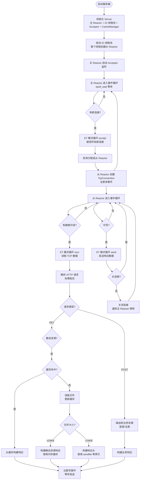

# WebServer-Reactor

基于 C++11 实现的**主从 Reactor 模式**高并发 Web 服务器，采用完全工程化结构设计，支持 HTTP/1.1 基础协议、长连接与静态资源服务。

## 核心特性

| 特性 | 说明 |
|------|------|
| 🎯 **标准主从 Reactor 架构** | 主 Reactor 仅负责连接接受，从 Reactor 负责 IO 事件处理，职责清晰 |
| 🧵 **One Loop Per Thread** | 每个 IO 线程绑定独立 EventLoop，线程间无锁竞争，**实测QPS超10万**，并发性能优异 |
| ⚡ **高性能 IO 模型** | Epoll 边缘触发 (ET) + 非阻塞 Socket + TCP_NODELAY，降低延迟与系统调用 |
| 🚀 **智能传输优化** | 基于文件大小的传输策略：小文件（≤24KB）使用用户态内存缓存，大文件（>24KB）使用 sendfile 零拷贝 |
| 🏗️ **工程化结构设计** | 模块化分层 (net/http/server/user)、CMake 构建、统一 reactor 命名空间 |
| 🌐 **完整 HTTP 支持** | GET/POST 请求解析、长连接 (Keep-Alive)、TCP 粘包处理、静态资源响应 |
| 👤 **用户登录注册** | 基于文件序列化存储用户信息，支持注册新用户、登录验证功能 |
| 💾 **静态资源内存缓存** | 实现基于 LRU 策略的内存缓存，读写锁并发控制，shared_ptr 零拷贝，大幅提升性能 |
| 📊 **内置性能压测支持** | 集成 wrk 压测脚本，提供详细压测指标与结果分析 |

## 项目结构

```
WebServer-Reactor/
├── include/          # 头文件目录
│   ├── net/          # 网络层 (EventLoop/Channel/Epoller/Acceptor)
│   ├── http/         # HTTP 层 (HttpRequest/HttpResponse)
│   ├── server/       # 服务器层 (Server/TcpConnection/CacheManager)
│   └── auth/         # 用户模块 
├── src/              # 源文件目录
│   ├── net/
│   ├── http/
│   ├── server/
│   ├── auth/
│   └── main.cpp      # 程序入口
├── www/              # 静态资源目录 (index.html等)
├── run_benchmark.sh  # 压测脚本
└── CMakeLists.txt    # CMake 构建配置
```

## 核心原理解析

### 1. 主从 Reactor 模式
Reactor 模式是一种**事件驱动**的网络编程模式，核心思想是将 IO 事件与业务处理分离：
- **主 Reactor (Base Reactor)**：仅负责监听端口，通过 `accept()` 接受新连接，不处理具体 IO
- **从 Reactor (IO Reactor)**：负责已建立连接的 IO 事件处理（读/写/关闭）
- **线程池**：管理多个从 Reactor，通过轮询 (Round-Robin) 分配新连接，实现负载均衡

### 2. One Loop Per Thread
- 每个线程（包括主线程和 IO 线程）都有且仅有一个 `EventLoop` 对象
- `EventLoop` 内部封装了 `Epoller`，负责该线程的所有事件循环
- 跨线程任务通过 `eventfd` 唤醒机制实现，避免锁竞争

### 3. Epoll 边缘触发 (ET)
- **水平触发 (LT)**：只要 fd 有数据就会一直通知，编程简单但效率低
- **边缘触发 (ET)**：仅在 fd 状态变化时通知一次，需配合**非阻塞 Socket** 循环读写，减少系统调用，性能更高
- 本项目所有 Socket（监听 fd、连接 fd）均采用 ET 模式

### 4. HTTP 处理流程
1. **TCP 数据读取**：从 Reactor 线程通过 `recv()` 循环读取数据（ET 模式）
2. **请求解析**：`HttpRequest` 通过有限状态机解析请求行、请求头，处理 TCP 粘包
3. **响应构建**：`HttpResponse` 生成状态行、响应头，读取静态资源作为响应体
4. **数据发送**：通过 `send()` 循环发送响应数据，非长连接则关闭连接

### 5. 静态资源内存缓存
- **高性能缓存设计**：基于 LRU 策略的内存缓存，支持缓存大小限制
- **并发控制**：使用 POSIX 读写锁，支持多线程并发读，单线程写
- **零拷贝**：使用 `std::shared_ptr<std::string>` 存储缓存内容，避免重复拷贝
- **LRU 淘汰**：当缓存达到大小限制时，自动淘汰最久未使用的缓存项

### 6. 智能传输优化
- **传输策略**：根据文件大小自动选择最优传输方式
  - **小文件（≤24KB）**：使用用户态内存缓存，减少系统调用和磁盘IO
  - **大文件（>24KB）**：使用 `sendfile` 零拷贝，避免内核→用户态→内核的多次拷贝
- **性能边界**：24KB 是经过实际压测验证的性能临界点，在此大小下两种传输方式性能相近
- **实现原理**：在 `TcpConnection::HandleRead()` 中根据文件大小动态选择传输路径

## 新增功能详解

### 1. POST 请求与请求体解析
- 扩展 `HttpRequest` 解析器，支持 POST 请求行、请求头及请求体的完整解析
- 自动处理 `Content-Length` 头，确保完整读取请求体数据，解决 TCP 粘包/半包问题
- 支持表单数据（`application/x-www-form-urlencoded`）解析，可提取键值对参数
- 示例请求处理流程：
  1. 从 Reactor 线程循环读取 TCP 数据（ET 模式）
  2. 解析请求头获取 `Content-Length`
  3. 继续读取直至请求体数据完整
  4. 解析表单数据并路由到对应业务处理（如登录/注册）

### 2. 用户登录注册（序列化）
- **用户信息管理**：实现 `UserManager` 类，负责用户注册、登录验证逻辑
- **文件序列化存储**：将用户信息（用户名、密码哈希等）序列化到本地文件（`data/users.dat`），无需依赖数据库
- **线程安全设计**：用户数据读写采用互斥锁保护，避免多线程并发访问冲突
- **业务接口**：
  - `POST /register`：接收用户名和密码，校验唯一性后创建新用户并序列化存储
  - `POST /login`：接收用户名和密码，与序列化文件中数据比对验证登录状态

### 3. 性能压测
#### 压测说明
- 压测工具：`wrk` 高性能 HTTP 压测工具
- 前置操作：清空系统缓存，避免缓存干扰压测结果
- 压测环境：12 核心 CPU，24 个 IO 线程
- 压测配置：
  - 小文件：12 个压测线程、400 个并发连接、持续压测 30 秒
  - 大文件：12 个压测线程、100-200 个并发连接、持续压测 30-60 秒

#### 压测脚本使用
项目根目录提供了自动化压测脚本 `run_benchmark.sh`，使用方法：

```bash
# 1. 给脚本添加执行权限
chmod +x run_benchmark.sh

# 2. 启动服务器后，运行压测脚本
./run_benchmark.sh
```

脚本会自动执行以下操作：
1. 同步磁盘数据
2. 清空系统缓存（需要 sudo 权限）
3. 等待系统稳定
4. 执行 wrk 压测并输出结果

#### 核心压测结果（优化后）
| 文件名称 | 大小 | QPS (Requests/sec) | 带宽 (Transfer/sec) |
|----------|------|-------------------|---------------------|
| welcome.html | 小文件 | 106684.01 | 107.34MB |
| index.html | 小文件 | 90421.31 | 0.93GB |
| 1mb.bin | 1MB | 11345.40 | 11.08GB |
| 10mb.bin | 10MB | 1031.59 | 10.09GB |
| 100mb.bin | 100MB | 104.45 | 10.28GB |

#### 完整压测日志（优化后）
```
==========================================
  Reactor WebServer 真实场景压测
  模式：HTTP/1.1 长连接 (Keep-Alive)
==========================================

==========================================
  压测目标: welcome.html
  参数: -t12 -c400 -d30s
==========================================
Running 30s test @ http://127.0.0.1:8888/welcome.html
  12 threads and 400 connections
  Thread Stats   Avg      Stdev     Max   +/- Stdev
    Latency     4.12ms    3.72ms 110.28ms   80.42%
    Req/Sec     8.94k     1.55k   16.97k    66.47%
  3210381 requests in 30.09s, 3.15GB read
Requests/sec: 106684.01
Transfer/sec:    107.34MB

==========================================
  压测目标: index.html
  参数: -t12 -c400 -d30s
==========================================
Running 30s test @ http://127.0.0.1:8888/index.html
  12 threads and 400 connections
  Thread Stats   Avg      Stdev     Max   +/- Stdev
    Latency     4.60ms    3.82ms  75.20ms   69.92%
    Req/Sec     7.58k     0.86k   12.46k    72.16%
  2720463 requests in 30.09s, 27.99GB read
Requests/sec:  90421.31
Transfer/sec:      0.93GB

==========================================
  压测目标: 1mb.bin
  参数: -t12 -c200 -d30s
==========================================
Running 30s test @ http://127.0.0.1:8888/1mb.bin
  12 threads and 200 connections
  Thread Stats   Avg      Stdev     Max   +/- Stdev
    Latency    10.30ms    5.53ms  88.34ms   76.16%
    Req/Sec     0.95k   217.43     1.79k    69.00%
  341405 requests in 30.09s, 333.45GB read
Requests/sec:  11345.40
Transfer/sec:     11.08GB

==========================================
  压测目标: 10mb.bin
  参数: -t12 -c150 -d30s
==========================================
Running 30s test @ http://127.0.0.1:8888/10mb.bin
  12 threads and 150 connections
  Thread Stats   Avg      Stdev     Max   +/- Stdev
    Latency   155.72ms  154.74ms   1.04s    83.63%
    Req/Sec    86.48     24.84   182.00     69.02%
  31049 requests in 30.10s, 303.77GB read
Requests/sec:   1031.59
Transfer/sec:     10.09GB

==========================================
  压测目标: 100mb.bin
  参数: -t12 -c100 -d60s --timeout 10s
==========================================
Running 1m test @ http://127.0.0.1:8888/100mb.bin
  12 threads and 100 connections
  Thread Stats   Avg      Stdev     Max   +/- Stdev
    Latency   918.97ms  541.26ms   3.76s    71.20%
    Req/Sec     9.96      5.97    50.00     74.13%
  6277 requests in 1.00m, 617.85GB read
Requests/sec:    104.45
Transfer/sec:     10.28GB
```

## 程序运行流程图



## 环境要求

- **操作系统**：Linux 内核 2.6+（依赖 Epoll 系统调用）
- **编译器**：GCC 7+ / Clang 5+（支持 C++17，使用 `std::shared_mutex` 和 `std::shared_ptr`）
- **构建工具**：CMake 3.10+
- **压测工具**：wrk（可选，用于性能测试）

## 快速开始

### 1. 编译项目

```bash
# 克隆项目并进入根目录
git clone <github.com/Linsdfe/WebServer-Reactor>
cd WebServer-Reactor

# 创建编译目录并生成构建文件
mkdir build && cd build
cmake .. -DCMAKE_BUILD_TYPE=Release

# 并行编译（-j 后接 CPU 核心数）
make -j$(nproc)
```

### 2. 运行服务器

```bash
# 编译完成后，可执行文件位于 build/bin/
cd bin

# 启动服务器（默认端口 8888，IO 线程数为 CPU 核心数*2）
./server

# 或指定端口和 IO 线程数
./server 8080 4
```

### 3. 访问测试

- **静态资源**：在浏览器中访问 `http://<服务器IP>:8888`，即可看到 `www/index.html` 页面
- **用户注册**：发送 POST 请求到 `http://<服务器IP>:8888/register`，表单数据包含 `username` 和 `password`
- **用户登录**：发送 POST 请求到 `http://<服务器IP>:8888/login`，表单数据包含 `username` 和 `password`

### 4. 性能测试

```bash
# 在项目根目录运行压测脚本
./run_benchmark.sh
```

## 扩展方向

- 📝 支持 JSON 请求体解析（`application/json`）
- 🔒 支持 HTTPS（集成 OpenSSL）
- 🗂️ 优化静态资源缓存机制（如内存映射文件）
- 📈 添加实时性能监控面板

