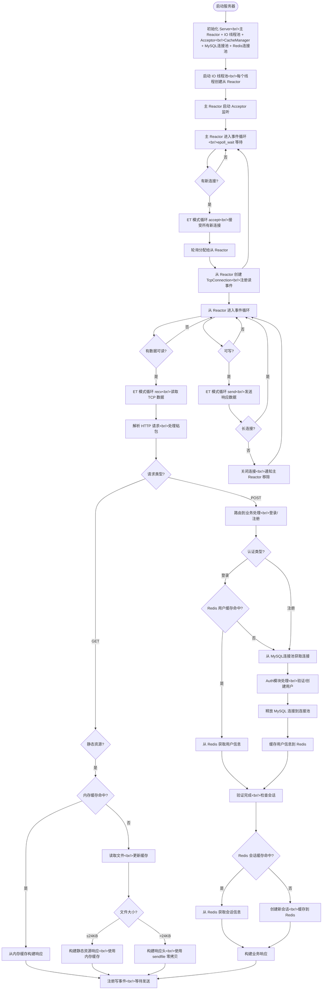

# WebServer-Reactor

基于 C++17 实现的**主从 Reactor 模式**高并发 Web 服务器，采用完全工程化结构设计，支持 HTTP/1.1 基础协议、长连接与静态资源服务。

## 核心特性

| 特性 | 说明 |
|------|------|
| 🎯 **标准主从 Reactor 架构** | 主 Reactor 仅负责连接接受，从 Reactor 负责 IO 事件处理，职责清晰，扩展性强 |
| 🧵 **One Loop Per Thread** | 每个 IO 线程绑定独立 EventLoop，线程间无锁竞争，**实测静态资源 QPS 突破 14 万**，并发性能优异 |
| ⚡ **高性能 IO 模型** | Epoll 边缘触发 (ET) + 非阻塞 Socket + TCP_NODELAY，显著降低延迟与系统调用开销 |
| 🚀 **智能传输优化** | 基于文件大小的传输策略：小文件（≤24KB）使用用户态内存缓存，大文件（&gt;24KB）使用 sendfile 零拷贝 |
| 🏗️ **工程化结构设计** | 模块化分层 (net/http/server/auth)、CMake 构建、统一命名空间，代码可维护性强 |
| 🌐 **完整 HTTP 支持** | GET/POST 请求解析、长连接 (Keep-Alive)、TCP 粘包处理、静态资源响应 |
| 👤 **用户登录注册** | 基于 MySQL 数据库存储用户信息，支持注册新用户、登录验证功能 |
| 📊 **MySQL 连接池** | 实现高效的数据库连接池，减少连接开销，提升认证功能性能 |
| 💾 **Redis 缓存** | 新增 Redis 连接池和缓存管理器，用户信息和会话缓存，**认证 QPS 提升 6.8 倍** |
| 💾 **静态资源内存缓存** | 实现基于 LRU 策略的内存缓存，读写锁并发控制，shared_ptr 零拷贝，大幅提升小文件访问性能 |
| 📈 **内置性能压测支持** | 集成 wrk 压测脚本，提供静态资源和认证功能的详细压测指标与结果分析 |

## 项目结构

```
WebServer-Reactor/
├── include/          # 头文件目录
│   ├── net/          # 网络层 (EventLoop/Channel/Epoller/Acceptor)
│   ├── http/         # HTTP 层 (HttpRequest/HttpResponse)
│   ├── server/       # 服务器层 (Server/TcpConnection/CacheManager/RedisCache)
│   └── auth/         # 用户认证模块 (Auth/MySQLConnectionPool/RedisConnectionPool)
├── src/              # 源文件目录
│   ├── net/          # 网络层实现
│   ├── http/         # HTTP 层实现
│   ├── server/       # 服务器层实现
│   ├── auth/         # 认证模块实现
│   └── main.cpp      # 程序入口
├── www/              # 静态资源目录
│   ├── index.html    # 首页
│   └── welcome.html  # 欢迎页
├── run_benchmark.sh        # 静态资源压测脚本
├── run_auth_benchmark.sh   # 认证功能压测脚本
├── CMakeLists.txt    # CMake 构建配置
└── .gitignore        # Git 忽略文件
```

### 模块职责说明

| 模块 | 主要职责 | 文件位置 |
|------|---------|----------|
| **网络层 (net)** | 实现 Reactor 模式、事件循环、通道管理、连接接受等核心网络功能 | include/net/, src/net/ |
| **HTTP 层 (http)** | 实现 HTTP 请求解析、响应构建、静态资源处理等 HTTP 协议相关功能 | include/http/, src/http/ |
| **服务器层 (server)** | 实现服务器核心逻辑、连接管理、缓存管理、Redis 缓存管理等功能 | include/server/, src/server/ |
| **认证模块 (auth)** | 实现用户登录注册逻辑、MySQL 连接池、Redis 连接池管理等功能 | include/auth/, src/auth/ |

## 核心原理解析

### 1. 主从 Reactor 模式
Reactor 模式是一种**事件驱动**的网络编程模式，核心思想是将 IO 事件与业务处理分离：
- **主 Reactor (Base Reactor)**：仅负责监听端口，通过 `accept()` 接受新连接，不处理具体 IO 操作
- **从 Reactor (IO Reactor)**：负责已建立连接的 IO 事件处理（读/写/关闭）
- **线程池**：管理多个从 Reactor，通过轮询 (Round-Robin) 分配新连接，实现负载均衡

### 2. One Loop Per Thread
- 每个线程（包括主线程和 IO 线程）都有且仅有一个 `EventLoop` 对象
- `EventLoop` 内部封装了 `Epoller`，负责该线程的所有事件循环
- 跨线程任务通过 `eventfd` 唤醒机制实现，避免锁竞争，提高并发性能

### 3. Epoll 边缘触发 (ET)
- **水平触发 (LT)**：只要 fd 有数据就会一直通知，编程简单但效率低
- **边缘触发 (ET)**：仅在 fd 状态变化时通知一次，需配合**非阻塞 Socket** 循环读写，减少系统调用，性能更高
- 本项目所有 Socket（监听 fd、连接 fd）均采用 ET 模式，最大化 IO 性能

### 4. HTTP 处理流程
1. **TCP 数据读取**：从 Reactor 线程通过 `recv()` 循环读取数据（ET 模式）
2. **请求解析**：`HttpRequest` 通过有限状态机解析请求行、请求头，处理 TCP 粘包
3. **响应构建**：`HttpResponse` 生成状态行、响应头，读取静态资源作为响应体
4. **数据发送**：通过 `send()` 循环发送响应数据，非长连接则关闭连接

### 5. 静态资源内存缓存
- **高性能缓存设计**：基于 LRU 策略的内存缓存，支持缓存大小限制
- **并发控制**：使用 POSIX 读写锁，支持多线程并发读，单线程写，平衡并发性能与数据一致性
- **零拷贝**：使用 `std::shared_ptr&lt;std::string&gt;` 存储缓存内容，避免重复拷贝
- **LRU 淘汰**：当缓存达到大小限制时，自动淘汰最久未使用的缓存项，优化内存使用

### 6. 智能传输优化
- **传输策略**：根据文件大小自动选择最优传输方式
  - **小文件（≤24KB）**：使用用户态内存缓存，减少系统调用和磁盘 IO，提高响应速度
  - **大文件（&gt;24KB）**：使用 `sendfile` 零拷贝，避免内核→用户态→内核的多次拷贝，提升带宽利用
- **性能边界**：24KB 是经过实际压测验证的性能临界点，在此大小下两种传输方式性能相近
- **实现原理**：在 `TcpConnection::HandleRead()` 中根据文件大小动态选择传输路径，确保每种文件大小都能获得最佳性能

### 7. MySQL 连接池设计
- **连接池原理**：预先创建一定数量的数据库连接，避免频繁创建和销毁连接的开销
- **核心特性**：
  - **连接复用**：通过连接池管理数据库连接，实现连接的复用
  - **线程安全**：使用互斥锁保护连接池的并发访问
  - **自动回收**：连接使用完毕后自动归还到连接池，而非直接关闭
  - **动态调整**：根据实际需求动态调整连接池大小
- **实现原理**：在 `MySQLConnectionPool` 类中维护一个连接队列，当需要数据库操作时从队列中获取连接，使用完毕后归还到队列

### 8. Redis 缓存与连接池设计
- **Redis 缓存设计**：
  - **用户信息缓存**：查询用户时先从 Redis 缓存获取，缓存未命中才查询 MySQL，查询结果自动缓存
  - **会话缓存**：登录成功后将会话信息缓存到 Redis，会话验证时优先从 Redis 检查
  - **缓存过期**：设置合理的缓存过期时间，确保数据一致性
- **Redis 连接池设计**：
  - **连接池初始化**：服务器启动时预创建 Redis 连接，数量为 IO 线程数 * 2
  - **连接验证**：预创建连接时进行 PING 测试，确保连接有效
  - **轻量级验证**：获取连接时仅检查连接错误状态，避免频繁 PING 带来的开销
  - **自动回收**：连接使用完毕后自动归还到连接池
- **性能提升**：通过 Redis 缓存，认证 QPS 从 1045.67 提升到 7110.55，**提升 6.8 倍**

## 功能详解

### 1. HTTP 请求处理
- **GET 请求处理**：支持静态资源请求，包括 HTML、图片、二进制文件等
- **POST 请求处理**：支持表单数据（`application/x-www-form-urlencoded`）解析
- **请求体解析**：自动处理 `Content-Length` 头，确保完整读取请求体数据，解决 TCP 粘包/半包问题
- **长连接支持**：实现 HTTP/1.1 Keep-Alive 机制，减少连接建立开销

### 2. 用户认证系统
- **核心功能**：实现用户注册和登录验证功能
- **数据存储**：使用 MySQL 数据库存储用户信息，Redis 缓存热点数据
- **认证接口**：
  - `POST /register`：接收用户名和密码，校验唯一性后创建新用户，自动缓存用户信息
  - `POST /login`：接收用户名和密码，验证用户身份，创建并缓存会话
- **安全设计**：密码存储采用安全的加密方式，防止密码泄露
- **缓存策略**：
  - 用户信息：缓存 Key 为 `user:{username}`，过期时间 3600 秒
  - 会话信息：缓存 Key 为 `session:{session_id}`，过期时间 3600 秒

### 3. MySQL 连接池
- **连接管理**：预先创建和管理数据库连接，避免频繁创建和销毁连接的开销
- **性能优化**：通过连接复用，显著提升数据库操作性能
- **线程安全**：支持多线程并发访问，确保数据一致性
- **可靠性**：实现连接超时和重连机制，提高系统稳定性

### 4. Redis 缓存系统
- **缓存管理器**：统一的 Redis 缓存接口，封装 Set、Get、Delete、Exists 等操作
- **连接池管理**：高效的 Redis 连接池，支持多线程并发访问
- **性能优化**：
  - 预创建连接，减少连接建立开销
  - 连接复用，避免频繁创建和销毁连接
  - 轻量级连接验证，减少不必要的网络开销
- **性能提升**：通过 Redis 缓存，认证功能 QPS 大幅提升

## 性能压测

### 1. 静态资源压测

#### 压测说明
- **压测工具**：`wrk` 高性能 HTTP 压测工具，支持多线程并发压测
- **前置操作**：清空系统缓存，避免缓存干扰压测结果，确保测试准确性
- **压测环境**：12 核心 CPU，24 个 IO 线程，Linux 环境
- **压测模式**：HTTP/1.1 长连接 (Keep-Alive)，模拟真实生产环境

#### 压测脚本使用
项目根目录提供了静态资源压测脚本 `run_benchmark.sh`，使用方法：

```bash
# 1. 给脚本添加执行权限
chmod +x run_benchmark.sh

# 2. 运行压测脚本
./run_benchmark.sh
```

**脚本执行流程**：
1. **生成测试文件**：删除并重新创建 `1mb.bin`、`10mb.bin`、`100mb.bin` 测试文件，确保测试数据一致性
2. **重新编译服务器**：清理旧构建目录，重新生成构建文件并编译，确保使用最新代码
3. **启动服务器**：杀死旧进程，启动新服务器并验证启动状态，确保服务正常运行
4. **清空系统缓存**：执行 `sync` 和 `echo 3 &gt; /proc/sys/vm/drop_caches`（需要 sudo 权限），避免系统缓存影响测试结果
5. **执行压测**：使用 wrk 对不同文件进行压测，收集性能数据
6. **生成报告**：汇总压测结果并输出详细报告，包括 QPS、带宽等关键指标
7. **停止服务器**：压测完成后停止服务器进程，释放系统资源

#### 压测参数配置
| 文件类型 | 压测线程 | 并发连接 | 压测时长 | 超时设置 | 测试目标 |
|---------|---------|---------|---------|---------|----------|
| 小文件 | 12 | 400 | 30秒 | 默认 | welcome.html, index.html |
| 中文件 | 12 | 200 | 30秒 | 默认 | 1mb.bin |
| 大文件 | 12 | 150 | 30秒 | 默认 | 10mb.bin |
| 超大文件 | 12 | 100 | 60秒 | 10秒 | 100mb.bin |

#### 核心压测结果
| 文件名称 | 大小 | QPS (Requests/sec) | 带宽 (Transfer/sec) | 性能分析 |
|----------|------|-------------------|---------------------|----------|
| welcome.html | 小文件 | 145484.89 | 146.38MB | 内存缓存效果显著，QPS 突破 14 万 |
| index.html | 小文件 | 102820.91 | 1.06GB | 内存缓存 + 高并发连接，带宽突破 1GB/s |
| 1mb.bin | 1MB | 12486.02 | 12.20GB | sendfile 零拷贝优势明显，带宽达到 12GB/s |
| 10mb.bin | 10MB | 1135.26 | 11.10GB | 大文件传输稳定，带宽维持在 11GB/s |
| 100mb.bin | 100MB | 93.94 | 9.24GB | 超大文件受网络传输限制，带宽仍保持在 9GB/s |

### 2. 认证功能压测

#### 压测说明
- **压测工具**：`wrk` 高性能 HTTP 压测工具
- **前置操作**：系统调优（文件描述符限制、网络参数优化、缓存清空）
- **压测环境**：12 核 CPU，24 个 IO 线程，48 个 MySQL 连接池，48 个 Redis 连接池
- **压测模式**：HTTP/1.1 长连接 (Keep-Alive)

#### 压测脚本使用
项目根目录提供了认证功能压测脚本 `run_auth_benchmark.sh`，使用方法：

```bash
# 1. 给脚本添加执行权限
chmod +x run_auth_benchmark.sh

# 2. 运行压测脚本
./run_auth_benchmark.sh
```

**脚本执行流程**：
1. **系统调优**：调整文件描述符限制、清空系统缓存、优化网络参数、禁用 ASLR
2. **数据库准备**：插入测试数据到 MySQL 数据库
3. **系统预热**：执行 10 秒预热测试，确保服务器稳定
4. **标准性能测试**：12 线程 / 200 并发 / 30 秒测试登录和注册接口
5. **极限性能测试**：24 线程 / 500 并发 / 60 秒测试登录接口
6. **生成报告**：汇总压测结果并输出详细报告
7. **清理数据**：清空测试数据，恢复系统设置

#### 认证功能压测结果

| 测试阶段 | 线程数 | 并发数 | 总请求 | QPS | 平均延迟 |
|----------|--------|--------|--------|-----|----------|
| 预热-登录 | 4 | 50 | 57347 | 5715.64 | 100.50ms |
| 标准-登录 | 12 | 200 | 208343 | 6921.62 | 42.89ms |
| 标准-注册 | 12 | 200 | 31609 | 1050.18 | 166.74ms |
| 极限-登录 | 24 | 500 | 427336 | 7110.55 | 70.32ms |

#### 性能对比（Redis 缓存效果）
- **添加 Redis 缓存前**：极限登录 QPS 1045.67
- **添加 Redis 缓存后**：极限登录 QPS 7110.55
- **性能提升**：**6.8 倍**

#### 性能总结
- **静态资源**：小文件 QPS 突破 14 万，大文件带宽达到 12GB/s，性能优异
- **认证功能**：
  - 登录接口：通过 Redis 缓存，极限 QPS 达到 7110.55，**提升 6.8 倍**
  - 注册接口：需要写入数据库，性能受限于 MySQL，QPS 为 1050.18
  - 整体：Redis 缓存对读密集场景（如登录验证）效果显著
- **系统调优**：通过系统参数优化，进一步提升了服务器性能和稳定性

## 程序运行流程图



## 环境要求

- **操作系统**：Linux 内核 2.6+（依赖 Epoll 系统调用）
- **编译器**：GCC 7+ / Clang 5+（支持 C++17，使用 `std::shared_mutex` 和 `std::shared_ptr`）
- **构建工具**：CMake 3.10+（跨平台构建支持）
- **数据库**：MySQL 5.7+（用于用户认证功能）
- **缓存服务**：Redis 5.0+（用于用户和会话缓存）
- **压测工具**：wrk（可选，用于性能测试）

## 快速开始

### 1. 环境准备

#### 1.1 安装 MySQL 数据库

```bash
# Ubuntu/Debian
apt update &amp;&amp; apt install mysql-server

# CentOS/RHEL
yum install mysql-server

# 启动 MySQL 服务
systemctl start mysql

# 安全初始化（设置 root 密码等）
mysql_secure_installation
```

#### 1.2 创建数据库和表

```bash
# 登录 MySQL
mysql -u root -p

# 创建数据库
CREATE DATABASE webserver;

# 使用数据库
USE webserver;

# 创建用户表
CREATE TABLE users (
    id INT AUTO_INCREMENT PRIMARY KEY,
    username VARCHAR(50) UNIQUE NOT NULL,
    password VARCHAR(255) NOT NULL,
    created_at TIMESTAMP DEFAULT CURRENT_TIMESTAMP
);

# 创建测试用户（可选）
INSERT INTO users (username, password) VALUES ('test', 'password123');
```

#### 1.3 安装 Redis 缓存

```bash
# Ubuntu/Debian
apt update &amp;&amp; apt install redis-server

# CentOS/RHEL
yum install epel-release
yum install redis

# 启动 Redis 服务
systemctl start redis
systemctl enable redis  # 设置开机自启

# 验证 Redis 服务
redis-cli ping
# 返回 PONG 表示服务正常
```

### 2. 编译项目

```bash
# 克隆项目并进入根目录
git clone &lt;github.com/Linsdfe/WebServer-Reactor&gt;
cd WebServer-Reactor

# 创建编译目录并生成构建文件
mkdir build &amp;&amp; cd build
cmake .. -DCMAKE_BUILD_TYPE=Release

# 并行编译（-j 后接 CPU 核心数）
make -j$(nproc)
```

### 3. 运行服务器

```bash
# 编译完成后，可执行文件位于 build/bin/
cd bin

# 启动服务器（默认端口 8888，IO 线程数为 CPU 核心数*2）
./server

# 或指定端口和 IO 线程数
./server 8080 4
```

启动后会显示配置信息：
```
==========================================
   Reactor WebServer v1.0
==========================================
   CPU Logical Cores: 12
   IO Threads:        24
   Listen Port:      8888
   MySQL Host:       localhost
   MySQL User:       root
   MySQL Database:   webserver_db
   MySQL Pool Size:  48
   Redis Host:       localhost
   Redis Port:       6379
   Redis Pool Size:  48
==========================================
```

### 4. 访问测试

- **静态资源**：在浏览器中访问 `http://&lt;服务器IP&gt;:8888`，即可看到 `www/index.html` 页面
- **用户注册**：发送 POST 请求到 `http://&lt;服务器IP&gt;:8888/register`，表单数据包含 `username` 和 `password`
- **用户登录**：发送 POST 请求到 `http://&lt;服务器IP&gt;:8888/login`，表单数据包含 `username` 和 `password`

### 5. 性能测试

#### 5.1 静态资源压测

```bash
# 在项目根目录运行压测脚本
./run_benchmark.sh
```

#### 5.2 认证功能压测

```bash
# 在项目根目录运行认证压测脚本
./run_auth_benchmark.sh
```

## 扩展方向

- 📝 支持 JSON 请求体解析（`application/json`）
- 🔒 支持 HTTPS（集成 OpenSSL）
- 🗂️ 优化静态资源缓存机制（如内存映射文件）
- 📈 添加实时性能监控面板
- 🐳 容器化部署支持（Docker）
- 🚀 支持 HTTP/2 协议
- 💾 添加更多 Redis 缓存场景（如热门文章、用户行为等）
- 🔄 Redis 主从复制支持，提升缓存可用性

## 技术亮点总结

### 核心优势
- **卓越性能**：
  - 静态资源：小文件 QPS 突破 14 万，大文件带宽达到 12GB/s
  - 认证功能：通过 Redis 缓存，登录 QPS 达到 7110.55，**提升 6.8 倍**
- **高并发架构**：主从 Reactor 模式 + One Loop Per Thread，线程间无锁竞争，充分利用多核性能
- **智能传输**：基于文件大小的动态传输策略，小文件使用内存缓存，大文件使用 sendfile 零拷贝
- **高效缓存**：双层缓存策略（内存缓存 + Redis 缓存），内存缓存提升静态资源性能，Redis 缓存缓解 MySQL 压力
- **可靠稳定**：线程安全设计、完整的 HTTP 协议支持、健壮的异常处理机制
- **工程化设计**：模块化分层架构、清晰的代码结构、完善的文档和自动化脚本

### 应用场景
- **静态资源服务**：高性能处理 HTML、图片、二进制文件等静态资源
- **用户认证系统**：基于 MySQL + Redis 的登录注册功能，支持高并发访问
- **Web 应用后端**：可作为 Web 应用的后端服务，提供高效的 HTTP 服务
